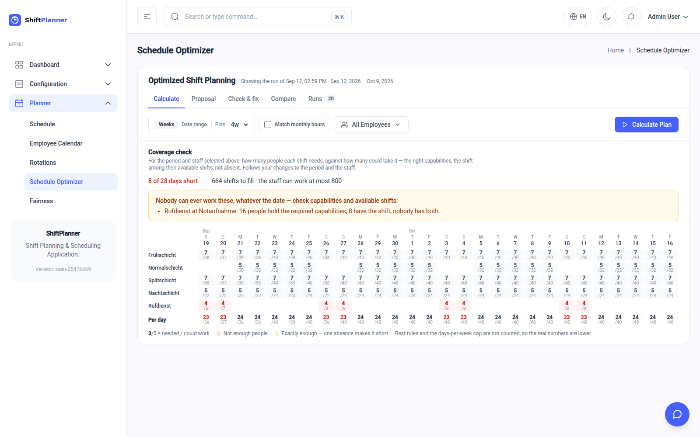
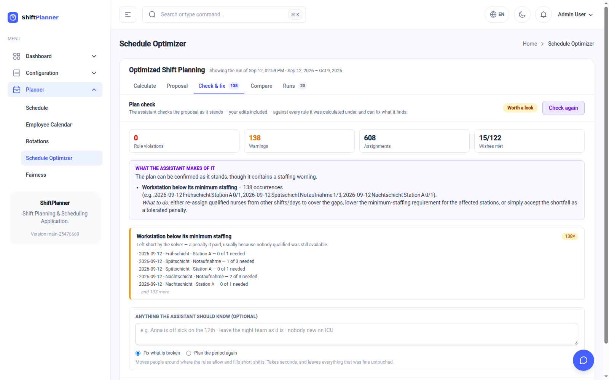
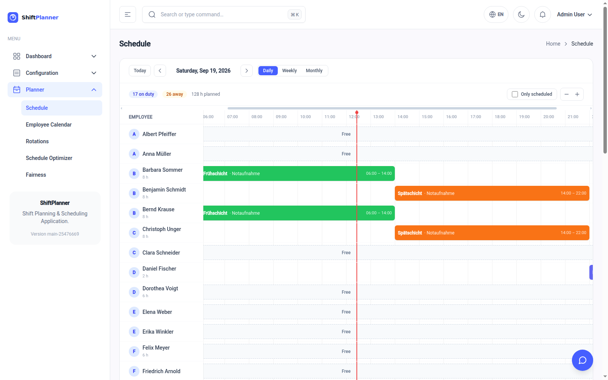
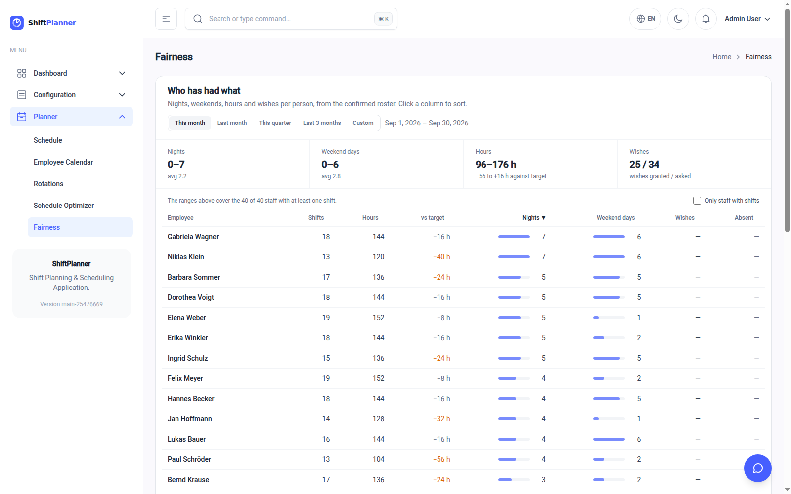
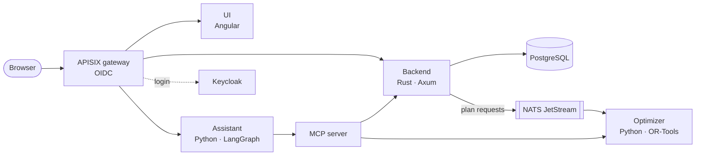

# Shift Planner

**Open-source shift planning for hospital wards.** Shift Planner builds a
monthly roster that respects the rules a ward actually works under: rest
periods, recovery after nights, qualifications, contracted hours, rotations and
people's wishes. It then leaves the last word to the person who plans.

It is a complete service: a web app for planners and staff, a REST API, a
constraint solver that writes the roster, and an assistant you can ask in plain
language ("who covers the ICU night on Saturday?").

[Documentation](https://uid09552.gitlab.io/shift/) ·
[API specification](api/openapi.yaml) ·
[Contributing](CONTRIBUTING.md) ·
[License](#license) ·
[GitLab](https://gitlab.com/uid09552/shift) ·
[GitHub mirror](https://github.com/uid09552/shift)


---

## Why it exists

Most wards still plan in spreadsheets. A good roster has to satisfy dozens of
rules at once. Some are legal (eleven hours between shifts, two days off after a
night), some are organisational (every ICU shift needs someone with intensive
care training), and some are human (fair turns at weekends, a wish for the
12th off). Doing that by hand takes days every month, and the result is still
easy to get wrong and hard to explain.

Shift Planner treats rostering as what it is, a constraint problem. It fills
every post it can first. Then it balances hours, nights, weekends and wishes as
fairly as the rules allow, and says plainly which slots it could not fill and
why. The planner reviews the proposal, changes what they want, has it checked
and takes it as the plan. Nothing reaches the roster without a person deciding.

## What it does

**Planning**
- Calculates a roster for up to three months with Google OR-Tools (CP-SAT).
  Minimum staffing is solved first; balance, wishes and fatigue come after
  without leaving a filled slot empty.
- Enforces the rules: qualifications, availability, absences, minimum rest,
  night-shift recovery, maximum consecutive days, days per week, and
  workstation closures.
- Spreads the load: evens out hours and contracted hours, and weighs the
  worst-off person's fatigue rather than the average.
- Keeps rotations (*early, early, late, late, night, off, off, off*) ahead of
  every other goal, or ignores them if you switch that off.
- Treats every result as a proposal. You can edit it by hand, check it against
  the rules, have it repaired automatically, and compare it with another run
  before taking it as the plan.
- Shows a coverage forecast before you calculate: which shifts cannot possibly
  be staffed with the people and qualifications you have.

**Everyday use**
- Schedule by employee, workstation or shift, an hour-by-hour day view, and a
  personal calendar with wishes, absences and an hours summary.
- A fairness page showing who has had the nights, weekends and hours.
- Shift wishes, within a wish window the admin opens and closes.
- An audit log of who changed what, with a field-by-field diff.
- Excel export, and roster import from a file.
- English and German.

<table>
<tr>
<td width="50%"><br><sub><b>Coverage check</b>: which shifts cannot be staffed, before you calculate</sub></td>
<td width="50%"><br><sub><b>Check &amp; fix</b>: the proposal re-checked against every rule, with a repair button</sub></td>
</tr>
<tr>
<td><br><sub><b>Day view</b>: who is on the ward, hour by hour</sub></td>
<td><br><sub><b>Fairness</b>: nights, weekends, hours and wishes per person</sub></td>
</tr>
</table>

**For the organisation**
- Multi-tenant: each organisation plans its own ward. Users and organisations
  live in Keycloak, with three roles (admin, planner, viewer).
- An assistant that can use the whole API, served over the
  [Model Context Protocol](https://modelcontextprotocol.io). The same tools work
  from any MCP client.
- OpenTelemetry tracing, container images scanned by Trivy, SBOMs, and
  dependency updates by Renovate, in both GitLab CI and GitHub Actions.

## Architecture



| Component | Directory | Technology |
|---|---|---|
| Backend: REST API, data, tenants, audit | [`src/`](src/), [`migrations/`](migrations/) | Rust, Axum, Diesel, PostgreSQL |
| Optimizer: builds the roster | [`planner/`](planner/) | Python, OR-Tools CP-SAT, Flask, NATS |
| Web app | [`ui/`](ui/) | Angular, Tailwind CSS |
| Assistant and MCP server | [`agent/`](agent/) | Python, LangGraph, FastMCP |
| Deployment: Compose stack, gateway, Keycloak | [`deploy/`](deploy/), [`release/`](release/) | Docker Compose, APISIX, Keycloak |
| Documentation | [`docs/`](docs/) | MkDocs Material |
| End-to-end tests | [`e2e/`](e2e/) | Robot Framework, Playwright |

The backend publishes planning requests to NATS, and the optimizer answers
there. The assistant calls the same REST API through its MCP server, so it can
never do more than the signed-in user could.

## Getting started

### Try it: the published images

The [`release/`](release/) folder runs the prebuilt images with the gateway and
Keycloak in front. Nothing is compiled.

```bash
cd release
docker network create backend
docker network create dev_backend
make init            # creates .env, agent.env and iam/.env from the templates
$EDITOR .env         # database password, ports
make pull && make up
make iam-up          # Keycloak, as its own Compose project
```

Then open <http://localhost/>. The images come from the GitLab registry by
default; the GitHub mirror publishes the same ones to
`ghcr.io/uid09552/shift/<component>`. See [`release/README.md`](release/README.md)
for switching between them and for the settings that matter before going to
production.

### Develop: run the pieces locally

You need Docker, Rust (stable), Python 3.11+ with [uv](https://docs.astral.sh/uv/),
and Node.js 20 or newer.

```bash
# PostgreSQL and NATS
docker network create backend
docker network create dev_backend
make db-up

# Backend on :8082. Migrations run at startup. --dev-mode pins every request
# to tenant 0, so no login is needed. Never use it outside development.
make serve PORT=8082 DEV=1 TENANT_ID=0

# Example data (in a second terminal)
make seed SEED_URL=http://127.0.0.1:8082/api/v1

# Optimizer: listens on NATS for plan requests
cd planner && make install && make nats

# Web app on http://localhost:4200/planner/ (it proxies /api to :8082)
cd ui && npm install && npm start
```

The assistant is optional: see [`agent/README.md`](agent/README.md).
[Getting started](docs/getting-started.md) covers every component, its ports
and its configuration.

## Documentation

The full documentation is published at
**<https://uid09552.gitlab.io/shift/>** and lives in [`docs/`](docs/):

- **For planners:** first steps, creating a plan, how planning works,
  troubleshooting
- **For developers:** architecture, domain model, REST API, database,
  optimizer, assistant, frontend
- **For operators:** configuration, authentication and tenants, observability,
  deployment and CI

To preview it locally:

```bash
pip install -r docs/requirements.txt
mkdocs serve      # http://localhost:8000
```

## Contributing

Contributions are welcome: bug reports, fixes, features, translations and
documentation. Experience from wards that plan this way is especially useful.

- **Found a bug or have an idea?** Open an issue and describe what you expected
  and what happened.
- **Want to change something?** Read [CONTRIBUTING.md](CONTRIBUTING.md) for the
  local setup, the checks each component needs, and how merge requests are
  reviewed. For anything larger than a fix, open an issue first so we can agree
  on the approach.
- **Found a security problem?** Please don't open a public issue. Report it
  confidentially, as described in [CONTRIBUTING.md](CONTRIBUTING.md#security).

## License

Shift Planner is licensed under the [Apache License 2.0](LICENSE).
Contributions are accepted under the same license.
