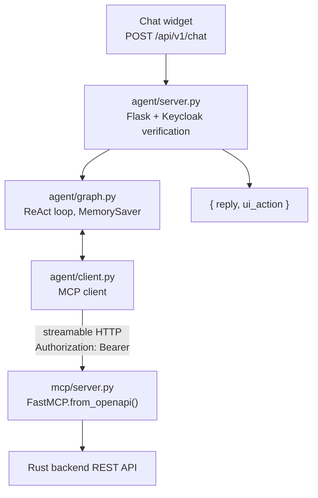

# Agent & MCP Server

`agent/` holds a LangGraph chat agent that lets signed-in users drive the app by
talking to it, and the MCP server it calls to get anything done.

The agent has **no backend tools of its own**. Every capability it has comes
from the MCP server, which is generated from `api/openapi.yaml` at startup. Add
an endpoint to the spec and the agent can use it — no agent code changes.



## `shift_agent/agent` — the chat agent

| File | Role |
|---|---|
| `graph.py` | The ReAct loop: the `agent` node calls the LLM, the `tools` node runs what it asked for, repeat until a plain-text answer. History is kept per `session_id` in LangGraph's in-memory `MemorySaver`. |
| `client.py` | Lists the MCP server's tools at startup and wraps each as a LangChain `StructuredTool`. |
| `server.py` | The HTTP surface. Validates the caller's token against Keycloak's JWKS, then stores it in a contextvar for the duration of the agent call. |
| `auth.py` | Keycloak verification plus the contextvar holding the token. |

One design point worth understanding: `client.py` opens a **fresh short-lived
MCP session per tool call**. A single long-lived session would fix its headers
at connect time, but the graph is a process-wide singleton shared by every user
— so the session must be created per call to carry the right user's token.

## `shift_agent/mcp` — the MCP server

`server.py` builds the tool surface with `FastMCP.from_openapi()`: every backend
operation becomes an MCP tool automatically, no hand-written wrappers to drift
out of date. The one exception is `navigate`, which has no REST equivalent — it
targets the browser, and `agent/server.py` turns it into a `ui_action` in the
chat response.

`auth.py` decides which token the server's backend calls carry: whatever the
caller presented, falling back to `BACKEND_ACCESS_TOKEN`.

The server is also usable directly by any MCP client:

```bash
uv run shift-agent mcp                                # stdio
uv run shift-agent mcp --transport http --port 8900   # streamable HTTP
```

Register it with Claude Code:

```bash
claude mcp add shift-backend -- uv --directory /path/to/backend/agent run shift-agent mcp
```

## LLM providers

Selected with `SHIFT_AGENT_LLM_PROVIDER`:

| Provider | Value | Example models | Key |
|---|---|---|---|
| Ollama (local) | `ollama` | `llama3.2`, `qwen2.5`, `mistral` | — |
| Ollama.com | `ollama-com` | `llama3.2-70b`, `qwen2.5-72b-instruct` | `OLLAMA_COM_API_KEY` |
| OpenAI | `openai` | `gpt-4o`, `gpt-4o-mini` | `OPENAI_API_KEY` |

`MCP_TOOLS` narrows what the model sees to a comma-separated allowlist. Worth
setting for small local models, which choose badly from all ~70 backend
operations. Unset means everything.

## Running it

```bash
cd agent
make install
cp .env.example .env
make mcp-http     # MCP server on :8900 — the agent needs it
make api          # chat API on :8899
make chat         # or a terminal session
```

Outside Docker, set `MCP_SERVER_URL=http://localhost:8900/mcp` — the default
targets the `mcp` Compose service. If the MCP server isn't up, the first chat
request returns 503 and the next retries.

## Chat API

```bash
curl -X POST http://localhost:8899/api/v1/chat \
  -H "Content-Type: application/json" \
  -H "Authorization: Bearer $TOKEN" \
  -d '{"message": "take me to the planner settings page"}'
```

```json
{
  "session_id": "default",
  "reply": "...",
  "ui_action": {"action": "navigate", "path": "/planner-settings"}
}
```

With no Keycloak configured (`KEYCLOAK_JWKS_URL` / `KEYCLOAK_REALM_URL` unset),
the endpoint accepts unauthenticated requests — development only.

## Token flow

One token travels the whole way: the user's. See
[Auth & Multi-Tenancy](auth.md) for the full chain. In short:

1. APISIX sets `X-Access-Token` on the chat route; `agent/server.py` verifies it
   against Keycloak's JWKS and puts it in a contextvar.
2. `agent/client.py` reads it back on every tool call and sends it as
   `Authorization: Bearer`.
3. `mcp/auth.py` attaches it to the backend call.

Every backend call therefore runs as the signed-in user, under that user's
tenant — the agent has no privileges of its own.

## Extending it

| Goal | What to do |
|---|---|
| New backend capability | Add it to `api/openapi.yaml` and the Rust backend. The MCP server picks it up automatically; add the name to `MCP_TOOLS` if you use an allowlist. |
| New navigable page | Add it to `KNOWN_PAGES` in `mcp/server.py` and to `ui/src/app/app.routes.ts`. |
| Persistent history | Swap `MemorySaver` in `agent/graph.py` for `SqliteSaver` or `PostgresSaver`. |
| Streaming replies | Use `graph.astream(...)` instead of `graph.ainvoke(...)` in `agent/server.py`, returned as chunked or SSE. |
