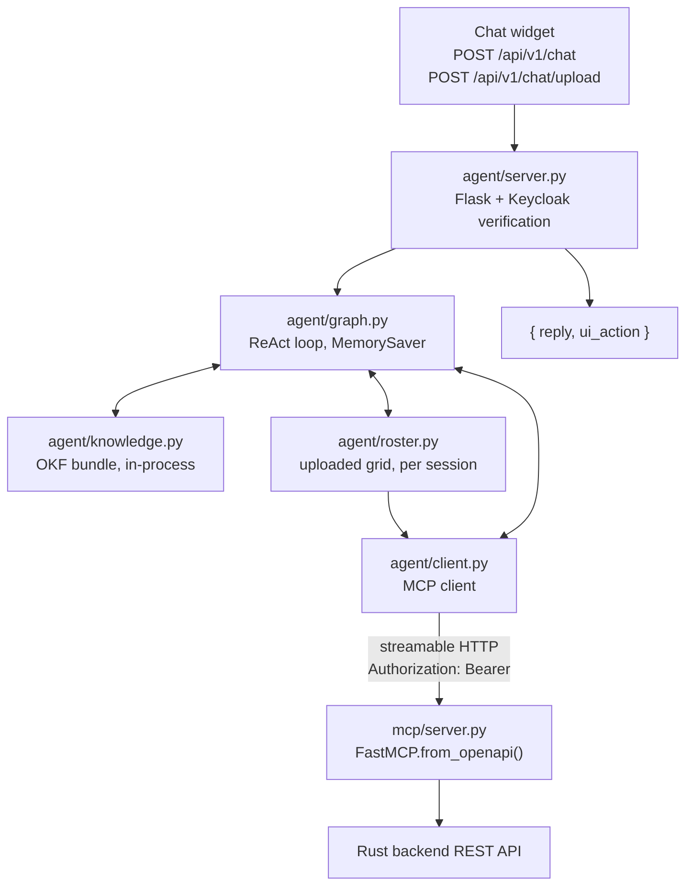
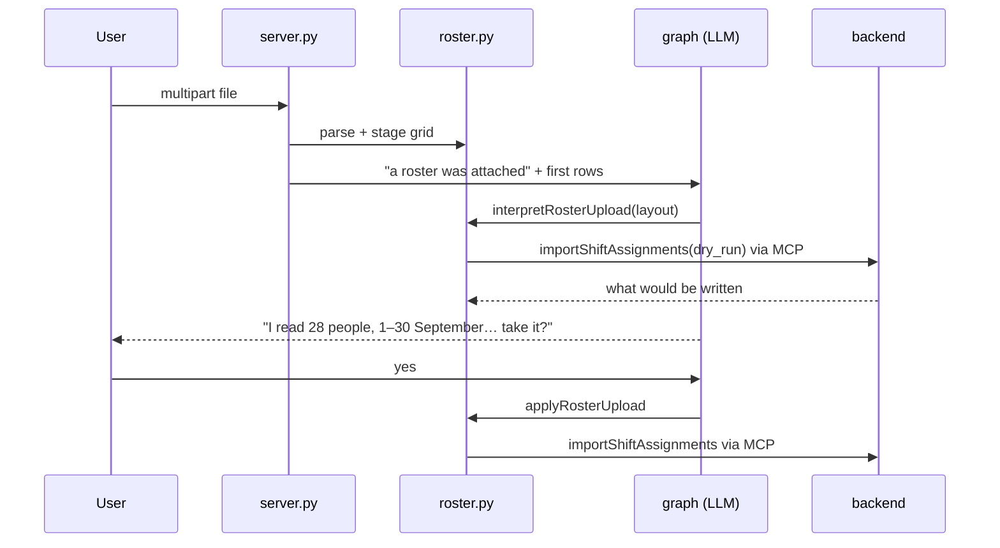

# Agent & MCP Server

`agent/` holds a LangGraph chat agent that lets signed-in users drive the app by
talking to it, and the MCP server it calls to get anything done.

The agent has **no backend tools of its own**. Everything that touches backend
state comes from the MCP server, which is generated from `api/openapi.yaml` at
startup. Add an endpoint to the spec and the agent can use it — no agent code
changes.

What it does hold locally is documentation: the [knowledge
bundle](#knowledge-base) it reads to explain how the product works, rather than
guessing from whatever the model happens to remember.



## `shift_agent/agent` — the chat agent

| File | Role |
|---|---|
| `graph.py` | The ReAct loop: the `agent` node calls the LLM, the `tools` node runs what it asked for, repeat until a plain-text answer. History is kept per `session_id` in LangGraph's in-memory `MemorySaver`, and [capped](#context-window) before each call. |
| `client.py` | Lists the MCP server's tools at startup and wraps each as a LangChain `StructuredTool`. |
| `knowledge.py` | The agent's own tools — `searchKnowledge`, `readKnowledgeDoc`, `listKnowledgeTopics` — over the documentation bundle in `docs/knowledge`. |
| `clock.py` | The agent's other local tool, `currentDateTime` — see [Telling the time](#telling-the-time). |
| `documents.py` | Parses an uploaded PDF/CSV/XLSX into sheets of cell strings. Interprets nothing — see [Roster uploads](#roster-uploads). |
| `roster.py` | `previewRosterUpload`, `interpretRosterUpload`, `applyRosterUpload`, plus the per-session store the uploaded grid lives in. |
| `server.py` | The HTTP surface. Validates the caller's token against Keycloak's JWKS, then stores it in a contextvar for the duration of the agent call. |
| `auth.py` | Keycloak verification plus the contextvar holding the token. |

One design point worth understanding: `client.py` opens a **fresh short-lived
MCP session per tool call**. A single long-lived session would fix its headers
at connect time, but the graph is a process-wide singleton shared by every user
— so the session must be created per call to carry the right user's token.

## `shift_agent/mcp` — the MCP server

`server.py` builds the tool surface with `FastMCP.from_openapi()`: every backend
operation becomes an MCP tool automatically, no hand-written wrappers to drift
out of date. The one exception is `navigate`, which has no REST equivalent — it
targets the browser, and `agent/server.py` turns it into a `ui_action` in the
chat response.

`auth.py` decides which token the server's backend calls carry: whatever the
caller presented, falling back to `BACKEND_ACCESS_TOKEN`.

The server is also usable directly by any MCP client:

```bash
uv run shift-agent mcp                                # stdio
uv run shift-agent mcp --transport http --port 8900   # streamable HTTP
```

Register it with Claude Code:

```bash
claude mcp add shift-backend -- uv --directory /path/to/backend/agent run shift-agent mcp
```

## LLM providers

Selected with `SHIFT_AGENT_LLM_PROVIDER`:

| Provider | Value | Example models | Key |
|---|---|---|---|
| Ollama (local) | `ollama` | `llama3.2`, `qwen2.5`, `mistral` | — |
| Ollama.com | `ollama-com` | `llama3.2-70b`, `qwen2.5-72b-instruct` | `OLLAMA_COM_API_KEY` |
| OpenAI | `openai` | `gpt-4o`, `gpt-4o-mini` | `OPENAI_API_KEY` |

`MCP_TOOLS` narrows what the model sees to a comma-separated allowlist. Worth
setting for small local models, which choose badly from all ~70 backend
operations. Unset means everything. It does not affect the knowledge tools.

## Knowledge base

`docs/knowledge` is an [Open Knowledge
Format](https://github.com/google/open-knowledge-format) bundle: ~50 Markdown
documents, one concept each, with YAML frontmatter stating title, type,
description and tags. `agent/knowledge.py` loads it once at graph build time and
exposes three tools:

| Tool | Use |
|---|---|
| `searchKnowledge` | Keyword search over frontmatter and body; returns the best-matching documents with a snippet. |
| `readKnowledgeDoc` | One document in full, by bundle path (`concepts/shift.md`). |
| `listKnowledgeTopics` | The whole catalogue — path, title, description. |

This is what lets the agent answer "how do I confirm a plan", "what is a
capability", "why did the solver refuse" — questions the MCP tools cannot touch,
because those read state and never explain it. Retrieval is TF-IDF over the
frontmatter and body with crude stemming, not embeddings: at this corpus size
the curated frontmatter carries the signal, and there is no index to build or
model to ship.

The bundle root is fixed at startup, first match wins:

1. `--knowledge-path` on `shift-agent api` / `shift-agent chat`
2. `SHIFT_AGENT_KNOWLEDGE_PATH`
3. `backend/docs/knowledge` relative to the installed package — inside
   `deploy/Dockerfile.agent` that resolves to `/docs/knowledge`, where the image
   copies the bundle and `docker-compose.yml` pins the variable.

If the path holds no documents the tools are not bound at all: the agent keeps
working on its MCP tools and logs a warning. To check what a running agent can
actually see:

```bash
shift-agent knowledge                              # list every document
shift-agent knowledge "why is the plan infeasible" # what searchKnowledge returns
docker compose exec agent shift-agent knowledge    # …inside the container
```

## Telling the time

A model has no idea what day it is, yet most of what a ward manager asks is
anchored to now — "how many people work **today**", "who is on nights
**tomorrow**". `clock.py` binds one local tool, `currentDateTime`, returning the
date, weekday and time plus ready-made ranges for this week, next week and this
month; the system prompt tells the agent to call it before any relative-time
question. It is a tool rather than a date in the prompt because the graph is
built once per process: a date baked in at startup is wrong by the next morning.

Weekday numbering matches the rest of the system (0 = Monday … 6 = Sunday), and
`SHIFT_AGENT_TIMEZONE` sets the ward's timezone when it differs from the
server's.

That answers *when*. Answering *who* is
[`getStaffingPerDay`](api.md): one call returns the day's head count, the people
working with shift and workstation names already resolved, and the split per
shift. The agent is told to use it as it stands, because the two things it would
otherwise have to do — counting roster rows and matching employee ids to names —
are exactly what a small model gets wrong. For the same reason
`getStaffingPerDay` must be in `MCP_TOOLS` if you set that allowlist.

## Roster uploads

`POST /api/v1/chat/upload` takes a shift plan the ward already has — a
spreadsheet, a CSV, or a PDF printed from one — and turns it into
[shift assignments](knowledge/concepts/shift-assignment.md), with the user's
confirmation in between.



Two decisions shape this.

**The grid never reaches the model.** A month's roster is thirty people by
thirty days — nine hundred cells. Having the model transcribe those into tool
arguments would be slow, expensive, and wrong in the way transcription always
is, with nothing to check it against. So the model supplies only the *layout*:
which column holds the names, which row holds the dates, which month it is,
which codes mean a day off. A dozen numbers it reads off the preview. The
expansion from layout to nine hundred assignments happens in `roster.py`, in
Python, identically every time. The grid itself stays in the upload store.

**Nothing is written before the user agrees.** `interpretRosterUpload` dry-runs
the import and hands back the backend's own resolution report — which names
matched which employees, which codes matched which shifts, and what matched
nothing. The agent shows that and waits. `applyRosterUpload` replays exactly the
staged rows, so what lands is what was shown.

The writes still go through MCP like every other backend call: `roster.py` is
handed `MCPClient.call_sync` and invokes `importShiftAssignments` directly,
without the model in the loop. That means the tool works even when `MCP_TOOLS`
is set — the allowlist filters what is *bound to the model*, not what the agent
can call. The backend endpoint (`POST /shift-assignments/import`) matches
employees by full name, email, id or surname-first spelling, and shifts by name,
short name or id, because a roster document has names and no ids.

Formats, in descending order of how well they read: **XLSX** (real cells),
**CSV** (real cells, delimiter and encoding sniffed — cp1252 included, since
that is what German Excel writes), **PDF** (no cells at all — `pdfplumber`
recovers ruled tables exactly, infers columns from text alignment where there
are no rules, and falls back to splitting lines on wide gaps; a scan has no text
and is rejected with an explanation). Uploads are capped at 10 MB and expire
from the store after six hours.

## Context window

Every tool result stays in the session's history, and a session lives as long as
the process, so a busy chat grows steadily. Before each LLM call
`graph.py`'s `_fit_to_context` drops the oldest turns until what is sent fits
`SHIFT_AGENT_MAX_CONTEXT_TOKENS` (default 131072) minus the reply's
`SHIFT_AGENT_MAX_TOKENS`, keeping 15% back for the bound tool schemas that the
approximate token count cannot see.

- The system prompt is always kept, and the kept history starts at a user
  message — a tool result whose tool call has been trimmed away is a malformed
  conversation that providers reject.
- Only what is *sent* is capped. The full history stays in the checkpointer, so
  nothing is lost from the session itself.
- Set the variable to your model's real window: 131072 suits gpt-oss and
  llama 3.x, gpt-4o is 128000, small local models are often 8192.

## Running it

```bash
cd agent
make install
cp .env.example .env
make mcp-http     # MCP server on :8900 — the agent needs it
make api          # chat API on :8899
make chat         # or a terminal session
```

Outside Docker, set `MCP_SERVER_URL=http://localhost:8900/mcp` — the default
targets the `mcp` Compose service. If the MCP server isn't up, the first chat
request returns 503 and the next retries.

## Chat API

```bash
curl -X POST http://localhost:8899/api/v1/chat \
  -H "Content-Type: application/json" \
  -H "Authorization: Bearer $TOKEN" \
  -d '{"message": "take me to the planner settings page"}'
```

```json
{
  "session_id": "default",
  "reply": "...",
  "ui_action": {"action": "navigate", "path": "/planner-settings"}
}
```

Attaching a roster file is the same conversation, over multipart:

```bash
curl -X POST http://localhost:8899/api/v1/chat/upload \
  -H "Authorization: Bearer $TOKEN" \
  -F "file=@dienstplan_september.xlsx" \
  -F "session_id=default" \
  -F "message=this is September"
```

The reply is the same shape, plus an `upload` object naming the staged file and
its sheets. Confirming ("yes, take it") is an ordinary `POST /api/v1/chat` on
the same `session_id` — see [Roster uploads](#roster-uploads).

With no Keycloak configured (`KEYCLOAK_JWKS_URL` / `KEYCLOAK_REALM_URL` unset),
the endpoint accepts unauthenticated requests — development only.

## Token flow

One token travels the whole way: the user's. See
[Auth & Multi-Tenancy](auth.md) for the full chain. In short:

1. APISIX sets `X-Access-Token` on the chat route; `agent/server.py` verifies it
   against Keycloak's JWKS and puts it in a contextvar.
2. `agent/client.py` reads it back on every tool call and sends it as
   `Authorization: Bearer`.
3. `mcp/auth.py` attaches it to the backend call.

Every backend call therefore runs as the signed-in user, under that user's
tenant — the agent has no privileges of its own.

## Extending it

| Goal | What to do |
|---|---|
| New backend capability | Add it to `api/openapi.yaml` and the Rust backend. The MCP server picks it up automatically; add the name to `MCP_TOOLS` if you use an allowlist. |
| New navigable page | Add it to `KNOWN_PAGES` in `mcp/server.py` and to `ui/src/app/app.routes.ts`. |
| Persistent history | Swap `MemorySaver` in `agent/graph.py` for `SqliteSaver` or `PostgresSaver`. |
| Streaming replies | Use `graph.astream(...)` instead of `graph.ainvoke(...)` in `agent/server.py`, returned as chunked or SSE. |
