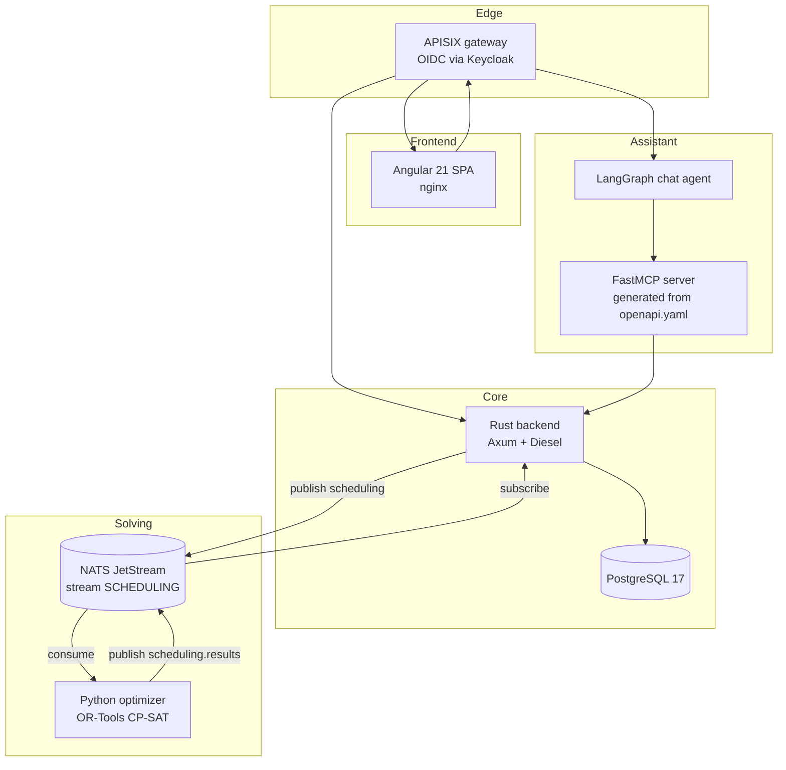
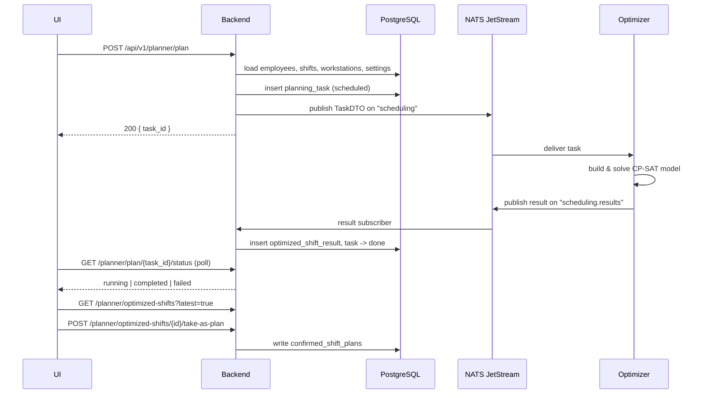

# Architecture

## Overview

The system is a set of small services around one relational database. The Rust
backend owns all persistent state; every other component talks to it, never to
PostgreSQL directly.

## Backend layering

The Rust service follows a hexagonal split — handlers hold no SQL, repositories
hold no HTTP.

| Layer | Location | Responsibility |
|---|---|---|
| Transport | [`src/server.rs`](https://gitlab.com/uid09552/shift/-/blob/main/src/server.rs) | Router, CORS, tenant middleware |
| Services | [`src/services/`](https://gitlab.com/uid09552/shift/-/blob/main/src/services) | Axum handlers, request validation, business rules, audit logging |
| Repositories | [`src/repository/`](https://gitlab.com/uid09552/shift/-/blob/main/src/repository) | Diesel queries behind async traits declared in `domain.rs` |
| Models | [`src/models/`](https://gitlab.com/uid09552/shift/-/blob/main/src/models) | Diesel row structs, request/response DTOs, optimizer task DTOs |

`AppState` carries the connection pool, the optional NATS client, the tenant
defaults and one boxed repository per aggregate. Because repositories are
traits, handlers are testable against fakes without a database.

Every repository method takes a `tenant_id` as its first argument. That is
deliberate: tenant scoping is a parameter you cannot forget to pass, not a
filter you might forget to add.

## The planning flow

Optimization is asynchronous. `POST /planner/plan` returns immediately with a
task id; the result arrives later over NATS.

Details worth knowing:

- **`POST /planner/prepare`** builds and returns the same `TaskDTO` the backend
  would publish, without solving anything. It is the debugging tool for "why
  did the solver see it that way".
- **Task states** are stored as `scheduled` / `done` / `error` and reported to
  clients as `running` / `completed` / `failed`.
- **Stale tasks** left in `scheduled` for more than three hours are marked
  failed at server startup ([`start_server`](https://gitlab.com/uid09552/shift/-/blob/main/src/server.rs)).
- **No JetStream, no problem** — if stream creation fails at connect time the
  broker falls back to plain publish, which the optimizer's HTTP mode can still
  serve.
- **Taking a result as the plan** copies the chosen optimizer output into
  `confirmed_shift_plans`, which is what the calendars and the analysis
  endpoints read.

## The agent path

The chat agent has no hand-written backend tools. `FastMCP.from_openapi()`
turns `api/openapi.yaml` into one MCP tool per operation, so an endpoint added
to the spec becomes agent-callable without touching agent code. The only
hand-written tool is `navigate`, which has no REST equivalent — it targets the
browser and comes back to the UI as a `ui_action`.

The signed-in user's access token travels the whole chain: browser → APISIX →
agent → MCP server → backend. Every call therefore runs as that user, under
that user's tenant. See [Auth & Multi-Tenancy](auth.md).

## Technology choices

| Concern | Choice | Why |
|---|---|---|
| Web framework | Axum 0.7 | Tower middleware, typed extractors — the tenant context is an extractor |
| ORM | Diesel 2.1 + r2d2 | Compile-time-checked queries against a generated schema |
| Solver | OR-Tools CP-SAT | Handles the mixed hard/soft constraint model natively |
| Broker | NATS JetStream | Durable hand-off for solves that can run for minutes |
| Config | Figment | Layered defaults → YAML → env → CLI flags |
| Gateway | APISIX | OIDC termination in front of every service at once |
| Spreadsheets | `rust_xlsxwriter` / `calamine` | XLSX import and export templates for bulk data entry |
