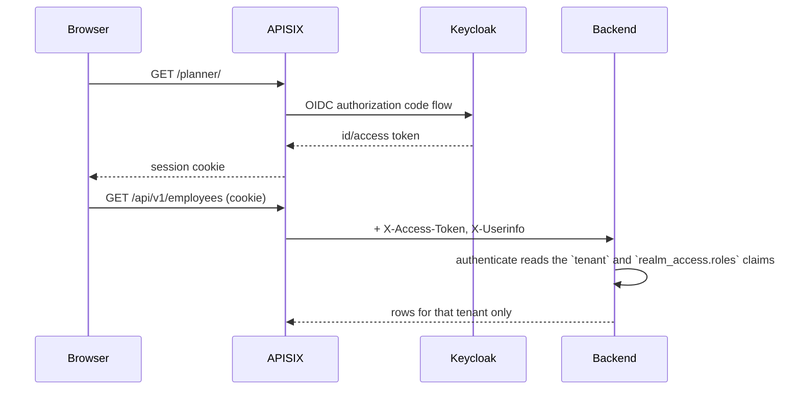

# Auth & Multi-Tenancy

Authentication happens at the edge; tenant isolation happens in the data
access layer. Neither is the other's job, and understanding where the line sits
is the point of this page.

## The chain



## The gateway

APISIX (`deploy/gateway/apisix_conf/apisix-standalone.yaml`) runs in standalone
mode and terminates OIDC against Keycloak for every protected route:

| Route | Purpose |
|---|---|
| `/` | Redirect to `/planner/` |
| `/auth/*` | Keycloak itself |
| `/planner/*` | The Angular UI, behind `openid-connect` |
| `/api/*` | The backend, behind `openid-connect` |
| `/agent/*` | The chat agent, rewritten to `/api/v1/*` |
| `/callback`, `/logout` | OIDC callback and logout |
| `/images/*` | Static assets |
| `/echo/*` | A request-echo service for verifying routing and headers |

The `openid-connect` plugin sets two headers on the upstream request:

- **`X-Access-Token`** — the raw JWT. The backend reads its `tenant` and
  `realm_access.roles` claims; the agent forwards it to its own MCP tool calls.
- **`X-Userinfo`** — base64 JSON, decoded by `GET /api/v1/self`.

## Tenant resolution

`authenticate` in
[`src/services/tenant.rs`](https://gitlab.com/uid09552/shift/-/blob/main/src/services/tenant.rs)
wraps the entire `/api/v1` subtree:

1. **Dev mode** — the configured `tenant_id` is used, no token needed.
2. **Otherwise** — the request must carry `x-access-token` with a JWT whose
   `tenant` claim is an array; the first entry wins. Missing or undecodable
   tokens are rejected with **401**, never falling back to the default tenant.

The middleware puts the result in the request extensions; handlers pull it out
via the `TenantContext` extractor, which also has no default. A request that
somehow reached a handler without resolution fails rather than operating on
someone else's data.

!!! note "The backend does not verify the signature"
    The middleware decodes the JWT payload only. Signature and expiry are
    verified by APISIX before the request ever arrives. **The backend must
    therefore never be exposed directly** — anything that can reach it can
    forge a `tenant` claim. Publish it only through the gateway.

## Roles

The same middleware reads the realm roles from the token:

```json
"realm_access": { "roles": ["shift-planner"] }
```

| Role | May do |
|---|---|
| `shift-admin` | Every method, plus the admin-only endpoints below |
| `shift-planner` | Every method — `GET`, `POST`, `PUT`, `PATCH`, `DELETE` |
| `shift-viewer` | `GET`/`HEAD` only, plus their own self-service data |

Anything else in `realm_access.roles` is ignored. A method the caller's roles do
not cover is rejected with **403** before the handler runs, so read-only access
is enforced in one place rather than per route. A token with none of these roles
can do nothing at all — not even read.

In dev mode there is no token, so every request is treated as a planner **and**
an admin — otherwise admin-only screens would be unreachable without a gateway
in front.

Handlers that need the roles themselves take the `RoleContext` extractor
(`can_read()` / `can_write()` / `is_admin()`); most do not, because the
middleware has already decided.

### Self-service writes

`SELF_SERVICE_SEGMENTS` in `src/services/tenant.rs` lists the path segments a
`shift-viewer` may mutate for their *own* records — today just `shift-wishes`.
The middleware lets those through on the method check; the handler then matches
the record's employee against the caller's `email` / `preferred_username` claim
(`UserContext::matches_email`) and rejects anyone else with 403.

Self-service shift wishes are additionally bounded by the tenant's **wish
window** (`/wish-settings`), which can close wishing entirely or restrict it to
a date range. See [REST API](api.md#the-wish-window).

### Admin-only endpoints

A few operations need more than write access. The middleware only knows the
request method, so these check `RoleContext::is_admin()` in the handler and
return 403 with a reason for anyone else — a `shift-planner` included.

| Endpoint | Why |
|---|---|
| `PUT /wish-settings` | Opening and closing the shift-wish window is a ward-management decision, not a planning one |

### What the frontend sees

`GET /self` returns the caller's OIDC profile plus a `roles` array of the realm
roles above. The UI uses it to hide what the caller cannot use — the sidebar
drops admin-only entries, and the employee calendar hides the wish picker on
days the window has closed. It is a convenience, never the enforcement: every
one of those rules is applied again in the backend. The roles are defined in the realm
(`deploy/iam/realm-shift.json`) and assigned to users there.

### `default-roles-<realm>` on imported users

Users listed in the realm import must include `default-roles-shift` in their
`realmRoles` alongside the app roles. Keycloak adds users from a realm import
*without* the realm's default role (unlike users created through the admin
console or registration), and `default-roles-shift` is what composites in the
`account` client's `view-profile` / `manage-account`. Leave it out and the user
can sign in to the app normally but gets **403** from Keycloak's own account
console — the "Profile" link in the user dropdown
(`/auth/realms/shift/account/`). Existing users are unaffected by editing the
template; grant them the role in the admin console (Users → Role mapping) or
with `kcadm.sh add-roles -r shift --uusername <user> --rolename default-roles-shift`.

## Isolation in the data layer

Every table carries `tenant_id`, and every repository method takes it as its
first argument:

```rust
async fn list_employees(&self, tenant_id: &str) -> Result<Vec<Employee>, Error>;
```

Scoping is a parameter you cannot omit, not a `WHERE` clause you might forget.
There is no row-level security policy in PostgreSQL, which means direct
database access — psql, ad-hoc scripts, backups — sees every tenant. Treat it
as privileged.

## Dev mode

```bash
make serve DEV=1 TENANT_ID=0
```

Sets `tenant.dev_mode = true`, so every request is scoped to `TENANT_ID` with
no token at all. That is what makes `curl` and `seed_data_v2.py` work without a
gateway.

!!! danger
    Dev mode removes authentication *and* tenant separation. It is for local
    development only.

## The agent's token chain

The signed-in user's token travels the whole way, so every call runs as that
user rather than as a service account:

1. **Into the agent** — `agent/server.py` takes the token from `X-Access-Token`
   (set by APISIX on the `/agent/*` route; falling back to the `Authorization`
   bearer for local testing), verifies it against Keycloak's JWKS, and stores it
   in a contextvar for that `graph.invoke()` call.
2. **Agent → MCP server** — `agent/client.py` reads it back on every tool call
   and sends it as `Authorization: Bearer`.
3. **MCP server → backend** — `mcp/auth.py` attaches it to the backend call.
4. **Fallback** — `BACKEND_ACCESS_TOKEN`, a single static token used where no
   per-request token exists: terminal chat, stdio transport, single-tenant
   deployments.

### MCP server auth

With `MCP_OAUTH_CLIENT_ID` / `MCP_OAUTH_CLIENT_SECRET` set, the HTTP MCP server
verifies incoming clients itself via `MultiAuth`: external MCP clients can use
Keycloak's authorization code grant with Dynamic Client Registration
(`OIDCProxy`), or present an existing bearer token directly (`JWTVerifier`;
`make mcp-token` fetches one).

In `deploy/docker-compose.yml` both are deliberately blanked for the `mcp`
service, because the OIDC library requires an HTTPS issuer URL that
`MCP_BASE_URL` isn't. The server then verifies nothing of its own and forwards
the caller's header as-is — APISIX and the backend still validate it. Put the
MCP server behind HTTPS and set both to re-enable its own verification.

## Identity provider

Keycloak runs in the Compose stack at `KC_HTTP_RELATIVE_PATH=/auth`, reachable
through APISIX at `/auth/*`. The realm definition is
`deploy/iam/realm-shift.json`.

`iam/bootstrap.sh` is a separate script targeting **Zitadel** (organisation,
project, OIDC application, and the matching APISIX routes) — an alternative
identity provider setup, not the one the Compose stack uses.

## Audit trail

Mutating operations record an entry in `audit_logs` with the actor, action,
entity and a JSON diff. Read it with `GET /api/v1/audit-logs`; it is
tenant-scoped like everything else, and cannot be written through the API.
