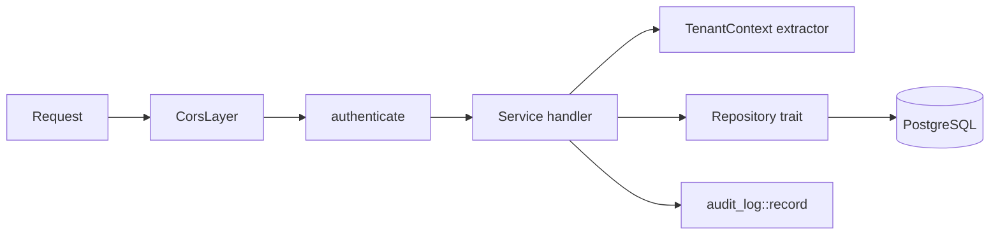

# Backend Service

The Rust service is the system's only writer of persistent state. Axum handles
transport, Diesel handles persistence, and a middleware layer resolves the
tenant before any handler runs.

## Source layout

```
src/
├── main.rs          CLI (clap): `serve` and its flags
├── lib.rs           library exports
├── server.rs        router, CORS, tenant middleware, startup tasks
├── config.rs        Figment configuration + CliArgs
├── database.rs      r2d2 connection pool
├── broker.rs        NATS connection, JetStream stream setup
├── errors.rs        AppError and its IntoResponse mapping
├── schema.rs        Diesel schema (generated)
├── models/          row structs, request/response DTOs, optimizer task DTOs
├── repository/      Diesel queries behind async traits (domain.rs)
└── services/        Axum handlers and business rules
```

## Request lifecycle



`authenticate` runs on the whole `/api/v1` subtree, so no handler can be
reached without a tenant having been established. It also enforces the caller's
realm roles against the request method — `shift-viewer` may only `GET`,
`shift-planner` may do everything — and answers **403** otherwise. `/health`
sits outside that nest and needs no auth. See [Auth](auth.md).

Handlers take a `TenantContext` extractor, which reads what the middleware put
in the request extensions. It deliberately has **no fallback** to the default
tenant: a request that somehow skipped resolution fails with 401 rather than
quietly operating on someone else's data. `RoleContext` works the same way for
handlers that need to vary their behaviour by role.

## Services

| Module | Covers |
|---|---|
| `employee.rs` | CRUD, capability and available-shift links, XLSX import/export |
| `shift.rs` | CRUD plus per-weekday times |
| `capability.rs` | CRUD and import |
| `workstation.rs` | CRUD, enable/disable, availability, required capabilities |
| `workstation_unavailability.rs` | Date ranges when a workstation is closed |
| `unavailability.rs` | Employee absences and soft preferences |
| `shift_assignment.rs` | Fixed pre-assignments |
| `confirmed_shift_plan.rs` | The approved schedule |
| `optimizer.rs` | Planning tasks, NATS publish/subscribe, optimizer results |
| `planner_settings.rs` | Per-tenant solver configuration |
| `analysis.rs` | Aggregate reporting endpoints |
| `audit_log.rs` | Writing and reading the audit trail |
| `auth.rs` | `/self` — decodes the gateway's `X-Userinfo` header |
| `tenant.rs` | Tenant middleware and extractor |
| `xlsx_io.rs` | Shared spreadsheet reading/writing helpers |

## Repository layer

`src/repository/domain.rs` declares one async trait per aggregate; each concrete
repository implements it over a Diesel connection pool. `AppState` holds them as
trait objects, which is what lets handlers be exercised against in-memory fakes.

Two conventions matter:

1. **Tenant first.** Every method's first parameter is `tenant_id`. Scoping is a
   signature requirement, not a convention you might forget.
2. **Blocking work off the async thread.** Diesel is synchronous; repositories
   run queries on a blocking pool rather than stalling the Tokio runtime.

## Error handling

`AppError` in `src/errors.rs` maps domain failures to HTTP:

| Variant | Status |
|---|---|
| `Validation(String)` | 400 with the message |
| `NotFound` | 404 |
| `Internal` | 500, details logged rather than returned |

## NATS integration

`broker::connect` opens the client and tries to create the `SCHEDULING` stream
over subject `scheduling`. If that fails, the connection is still returned with
`JetStreamStatus::Unavailable` and the service falls back to plain publish — a
NATS server without JetStream degrades the delivery guarantee, it does not take
the API down.

`optimizer::start_result_subscriber` runs for the process lifetime, consuming
`scheduling.results`, storing each result in `optimized_shift_results` and
advancing the matching `planning_tasks` row.

Subjects are constants in `src/services/optimizer.rs`:

```rust
pub const NATS_SCHEDULING_SUBJECT: &str = "scheduling";
pub const NATS_RESULTS_SUBJECT: &str = "scheduling.results";
```

## Startup sequence

1. Load configuration (defaults → `config.yaml` → env → CLI flags).
2. Build the connection pool and run embedded migrations.
3. Connect to NATS; record whether JetStream is available.
4. Mark planning tasks older than three hours and still `scheduled` as failed.
5. Start the result subscriber.
6. Bind and serve.

## XLSX import and export

Employees, shifts, capabilities and workstations each expose a matching pair:

```
GET  /api/v1/{resource}/template   # download an empty spreadsheet
POST /api/v1/{resource}/import     # multipart upload of a filled one
```

Templates are generated with `rust_xlsxwriter`; uploads are parsed with
`calamine`. This is how a ward is loaded in bulk instead of through the forms.

## Testing

```bash
make test    # cargo test
make check   # cargo check
```

Tests live in `tests/`. Because repositories are traits, handler tests can run
against fakes with no database; `tower-test` drives the router directly.
