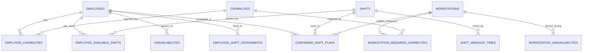

# Domain Model

Everything the system plans with reduces to six concepts: who can work
(**employees**), what they are qualified for (**capabilities**), when work
happens (**shifts**), where it happens (**workstations**), when people can't
(**unavailabilities**), and what was decided (**plans**).

## Employee

A member of staff. `name`, `email`, and `monthly_working_hours` — the contracted
monthly target the optimizer tries to hit (deviation is penalised, not
forbidden).

Two link tables define what an employee may do:

- **`employee_capabilities`** — qualifications held. A workstation is only open
  to an employee holding all of its required capabilities.
- **`employee_available_shifts`** — which shift types this person works at all.
  A day-only contract simply has no night shift here.

## Capability

A named qualification: *Intensive Care*, *Emergency Room*, *Surgery*. Two extra
fields support the skill-downgrade objective added in migration 22:

| Field | Meaning |
|---|---|
| `level` | Rank within a skill group; higher is more senior. Default `1`. |
| `skill_group` | Groups substitutable tiers of the same skill. `NULL` by default. |

When capabilities in a group are ranked, the optimizer may staff a post with a
higher-level person than strictly needed, but pays a `skill_downgrade_weight`
penalty for it — so senior staff are not silently burned on junior work. Leaving
`skill_group` unset (the default for all pre-existing rows) disables the
behaviour entirely.

## Shift

A named work period — *Early*, *Late*, *Night*. The shift row itself carries
only identity and presentation:

| Field | Meaning |
|---|---|
| `name`, `short_name` | Full and compact labels |
| `color` | Hex colour used across the calendars |
| `order` | Display order in shift lists and calendars |

Times are **per weekday**, in `shift_weekday_times`:

| Field | Meaning |
|---|---|
| `weekday` | 0–6 |
| `start_time`, `end_time` | Times for this weekday; `end < start` means the shift crosses midnight |
| `min_employees` / `max_employees` | Staffing band for that weekday |
| `free_days_after_shift` | Mandatory rest days following this shift |

A weekday with no row is a weekday the shift does not run. That is how a
Sunday-only reduced service is modelled: give the shift no Sunday row, or a
Sunday row with different hours.

## Workstation

A ward, unit, or post that must be staffed.

| Field | Meaning |
|---|---|
| `available` | Whether it is planned at all (`enable`/`disable` endpoints toggle it) |
| `active_shift_ids` | Which shifts operate here — a UUID array on the row |
| `priority` | `high`, `medium`, or `low`; drives which posts are filled first when staff run short |
| `min_employees` / `max_employees` | Headcount band per shift |

`workstation_required_capabilities` lists the qualifications needed, and
`workstation_unavailabilities` closes a date range (renovation, seasonal
closure) without deleting the workstation.

## Unavailability

An employee cannot work on a date. `shift_id` is optional: set, it blocks only
that shift; `NULL`, it blocks the whole day.

`is_soft_preference` decides how firmly:

- `false` (default) — a hard constraint. The solver will not assign it.
- `true` — a preference. The solver may override it under pressure, paying
  `preference_weight`.

That distinction is what separates "I am on holiday" from "I would rather not".

## Shift assignment

`employee_shift_assignments` fixes a person to a shift on a date before solving
— pre-arranged commitments the optimizer must respect and plan around.

## Confirmed shift plan

The approved schedule, one row per employee per day:

| Field | Meaning |
|---|---|
| `shift_id`, `workstation_id` | What was assigned; both nullable, for absence rows |
| `is_present` | Whether the person is working that day |
| `absence_type` | Why not, when `is_present` is false |
| `creation_type` | How the row came to be — optimizer output vs. manual edit |

These rows back the calendars and the `/analysis/*` endpoints. Optimizer output
becomes confirmed plan only when someone calls
`POST /planner/optimized-shifts/{id}/take-as-plan`.

## Optimized shift result

A raw solver result, stored as JSONB in `optimized_shift_results`. Kept
verbatim so several candidate plans can be compared before one is adopted, and
so a result stays reproducible after the underlying data has moved on.

## Planning task

One optimization run: `status` (`scheduled` → `done` | `error`), the `payload`
that was published, a `result_id` on success, and `error_message` on failure.
Tasks stuck in `scheduled` for more than three hours are marked failed on
startup.

## Planner settings

One row per tenant holding every tunable weight and limit for the solver. See
[Optimizer](planner.md#tunable-settings) for the full list and what each knob
does.

## Audit log

`audit_logs` records `actor`, `action` (e.g. `planner.optimize`),
`entity_type`, `entity_id`, and a JSON `changes` blob. Read-only over the API,
via `GET /audit-logs`.

## Tenancy

Every table above carries a `tenant_id`, and every repository method takes it as
its first argument. There is no "global" row anywhere in the schema. See
[Auth & Multi-Tenancy](auth.md).
