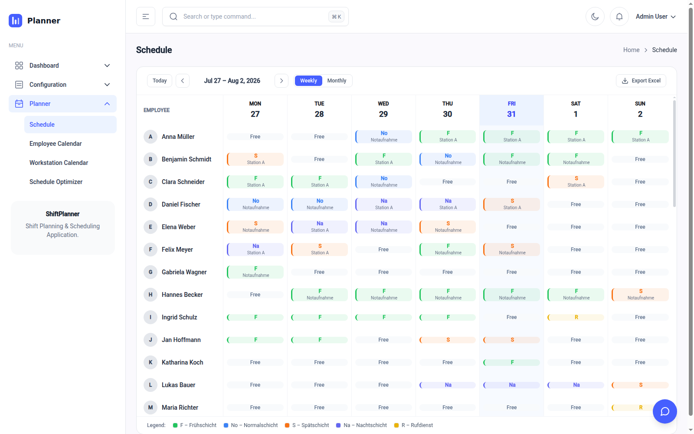
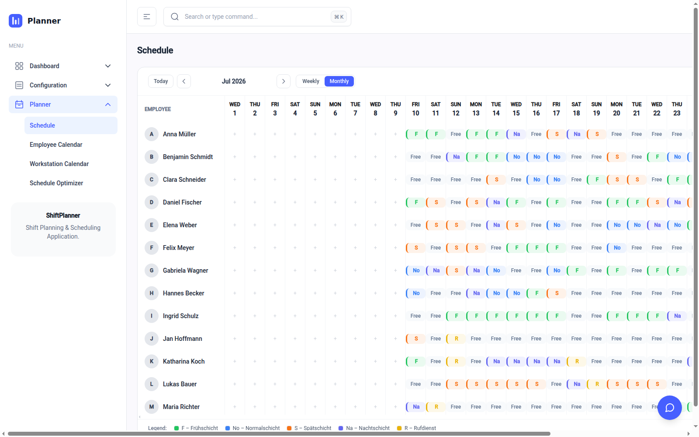
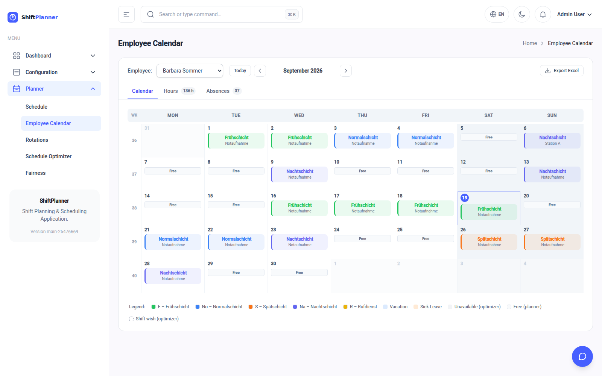
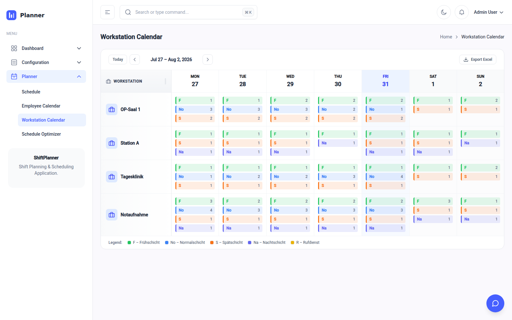

# Reading and adjusting the schedule

Once a roster is confirmed it appears in two calendars, and the Schedule reads
it three ways. They show the same information arranged differently — pick
whichever answers the question you actually have.

| View | Answers |
|---|---|
| **Schedule**, Week or Month | *Who is working, and when?* |
| **Schedule**, Day | *Who is on the ward at three o'clock?* |
| **Employee Calendar** | *What does one person's month look like?* |

*Is this place adequately covered?* is the Schedule view read **By
workstation** — see [below](#coverage-by-place-the-schedules-workstation-view).

Both are under **Planner** in the menu. The week and month views, and the
Employee Calendar, have an **Export Excel** button in the top right that saves
exactly what you are looking at.

---

## Schedule — the master roster

One row per person, one column per day. Each square shows the shift's short
name and, below it, the workstation. Grey **Free** means a day off.

**Daily / Weekly / Monthly** switches the span; the page opens on the week.
Monthly fits the whole month across the screen; you scroll sideways to reach
the end of it. Daily shows one day hour by hour — see
[below](#day-one-day-hour-by-hour). Clicking a day's heading in the week or
month opens that day.

The **legend** along the bottom decodes the abbreviations and colours — the
same colours you chose when setting up each shift.

### Changing a single day

Click any square.

- On a **day off**, a menu opens offering each shift, then each workstation.
  Pick a shift, then a workstation, and the person is scheduled.
- On an **existing assignment**, the same menu lets you switch to a different
  shift or move them to another workstation. A small delete button appears on
  hover to remove the assignment entirely.

Changes take effect immediately — this *is* the confirmed roster, not a
proposal. There is a confirmation step before deleting, but not before
changing.

!!! tip "Hand edits and recalculation"
    Anything you change here is overwritten if someone later confirms a
    calculated plan covering the same dates. For a few corrections that is
    fine. For a large reshuffle, it is safer to fix the underlying data
    (absences, availability) and recalculate.

---

## Day — one day, hour by hour

**Daily** on the Schedule page. The arrows next to the date go back and forward
one day; **Today** returns to today and scrolls to the current hour.

One row per person, and across the top a 24-hour ruler instead of a row of days.
Each shift is a coloured bar spanning the hours it actually runs, labelled with
the shift and the workstation.

This is the view for questions about *time of day* rather than dates: who is on
the ward mid-afternoon, whether the handover between late and night is covered,
who is around if the CT list overruns.

- **A shift running past midnight** is cut off square at the right-hand edge and
  marked ↦; the rest of it appears at the left edge of the next day, marked ↤.
  A night shift is visible on both days it touches, the way the ward experiences
  it.
- **Absences** stretch across the whole row in their own colour, with the reason
  written in.
- **A red line marks the current time** when you are looking at today.
- **− and +** zoom the hours in and out; the chart scrolls sideways at any zoom,
  with the names pinned on the left.
- **Only scheduled** hides everyone with nothing that day, leaving just the
  people on duty.

The header counts how many are on duty, how many are away, and the total hours
planned for the day. The search box in the top bar filters by name.

---

## Employee Calendar — one person's month

Choose a person from the dropdown. You get their month laid out as a normal
wall calendar, showing:

- **Shifts** they are working, with the workstation underneath.
- **Absences**, colour-coded: vacation, sick leave, and days marked
  unavailable.
- **Free** days the planner explicitly gave them off.
- **Shift wishes**, drawn as an outlined chip with a star — see [Managing your
  staff](people.md#shift-wishes).

Underneath is an **Hours Summary** with the planned working hours for the
month, which is the quickest way to check whether someone is heading over or
under their contract.

This is the view to print or export when somebody asks "what am I doing next
month?"

### Editing here

Click any empty day for a menu offering **Assign shift**, **Wish shift
(optimizer)** and **Workstation**. Existing entries can be changed or deleted
the same way as in the Schedule view.

---

## Coverage by place — the Schedule's workstation view

Switch the Schedule view to **By workstation**: one row per workstation, one
column per day, each cell listing the shifts running there with the **number of
people assigned** to each.

This is the view for spotting holes. Reading across a row tells you whether a
unit is consistently covered; reading down a column tells you how a particular
day is shaping up. Cells below the **Min** you set on the shift or the
workstation are marked, so a day showing `1` where you asked for `3` stands out
as the real shortfall it is.

!!! note "There used to be a separate page for this"
    The standalone *Workstation Calendar* showed the same confirmed plans, read
    only and for one week at a time. It has been folded into the Schedule view,
    which does the same thing over the week *or* the month and lets you edit
    what you find. Old links land on the Schedule page.

---

## Fairness — who has had what

**Planner → Fairness** lists everyone with their share of the confirmed roster
over a period: *This month*, *Last month*, *This quarter*, *Last 3 months*, or a
custom range.

| Column | What it counts |
|---|---|
| **Shifts**, **Hours** | Shifts worked and their hours. |
| **vs target** | Hours over or under the contracted monthly hours, scaled to the period. Amber when more than 10 % off. |
| **Nights** | Shifts that run past midnight. |
| **Weekend days** | Saturdays and Sundays worked; hover for how many weekends that touched. |
| **Wishes** | Shift wishes granted, of those asked. |
| **Absent** | Days marked sick, on leave or holiday — not plain days off. |

Click any column heading to sort by it — most first, click again for least. The
four figures at the top give the range across everyone who worked, so a gap of
0–10 nights stands out before you read a single row. Click a name to open that
person's calendar.

It reads the **confirmed** roster only. To see how a proposal would share the
work before you take it, use **Compare** on the Schedule Optimizer.

---

## Exporting

Every calendar has an **Export Excel** button that exports the current view —
the week or month you are looking at, in the arrangement you are looking at.

Use it to:

- print or circulate the roster;
- send one person their own month from the Employee Calendar;
- keep an archive copy before recalculating a period.

---

## The dashboard as a quick check

Before you go digging through calendars, the **Dashboard** often answers the
question already: today's coverage per workstation, how many people are on
leave, and the planned-hours-per-day chart that reveals unplanned stretches at
a glance. See [First steps](first-steps.md#the-dashboard-explained).
