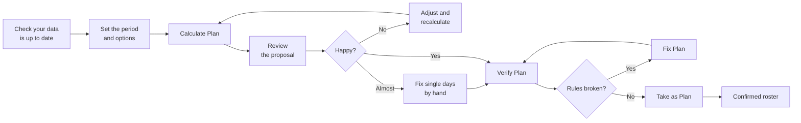
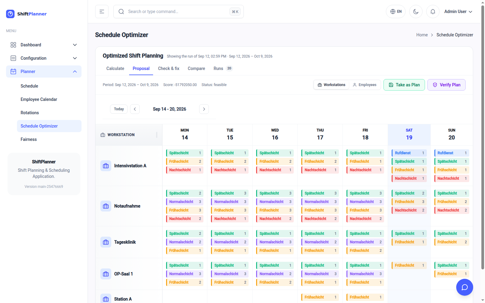
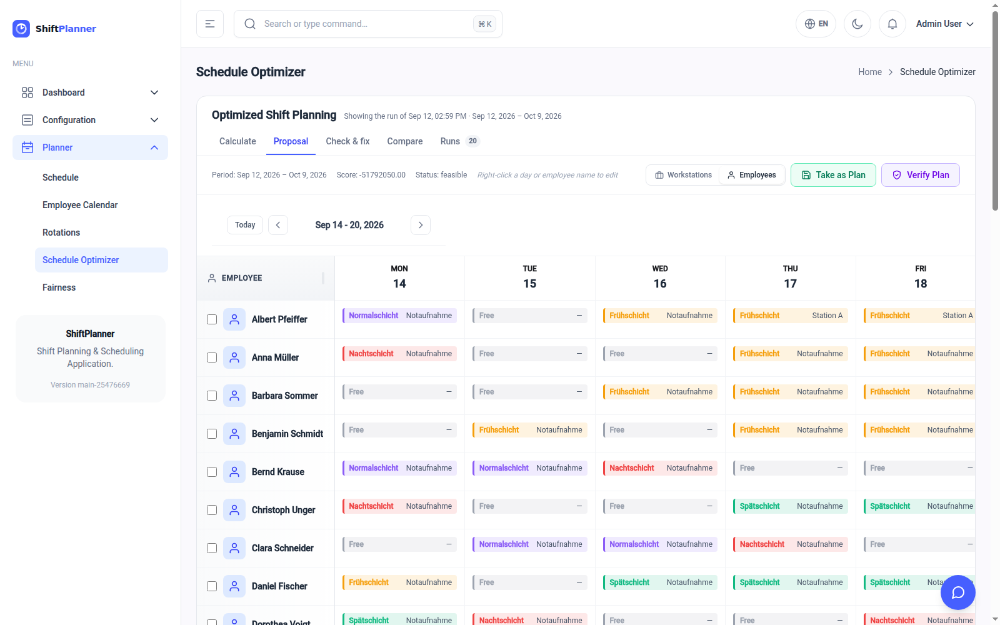

# Creating a schedule

This is the main event. Open **Planner → Schedule Optimizer**.

!!! note "Who can do this"
    Calculating and confirming a roster needs the **Planner** role (or Admin).
    Colleagues with the **Viewer** role can watch a proposal appear but cannot
    calculate or confirm one — see [Users, roles and
    history](administration.md).

The page has five tabs, in the order you work through them:

| Tab | What it is for |
|---|---|
| **Calculate** | Choose the period and staff, see who could cover each shift, and start a calculation. |
| **Proposal** | The calculated plan — by workstation or by employee — to review, edit and *Take as Plan*. |
| **Check & fix** | Have the assistant check the proposal against your rules, and put right what it finds. |
| **Compare** | Two calculated plans side by side. |
| **Runs** | Every stored proposal — open or delete one — and the queue of calculations behind them. |

The tab you are on is kept in the address, so a reload or a shared link lands in
the same place.

## The workflow in one picture

The important thing to understand: **a calculated plan is only a proposal.** It
sits to one side, harming nothing, until you press **Take as Plan**. You can
calculate as many as you like and compare them.

---

## Step 1 — Check your data first

Two minutes here saves an hour of confusion later:

- Are this period's **holidays and sickness** entered? ([Managing your
  staff](people.md))
- Have any **new colleagues** been added, and do they have their
  qualifications ticked?
- Are the **workstations** you want staffed marked *Available*?

The planner can only work with what it has been told.

## Step 2 — Set the period and options

The **Calculate** tab controls what gets calculated.

| Control | What it does |
|---|---|
| **Weeks / Date range** | *Weeks* plans a number of weeks starting from now (2, 4, 6…). *Date range* lets you pick an exact start and end date. |
| **Plan `4w`** | How many weeks ahead to plan, when in *Weeks* mode. |
| **Match monthly hours** | Tick this to make the planner work hard at hitting each person's contracted monthly hours. Leave it off when planning a short stretch that isn't a whole month, where the target doesn't mean much. |
| **All Employees** | Restricts the calculation to a subset of staff. Useful for planning one team separately; leave it on *All Employees* for a normal ward roster. |

!!! tip "How far ahead to plan"
    Four weeks is the usual choice. Planning further ahead gives the planner
    more room to even out the workload, but everything beyond a few weeks
    tends to be invalidated by real life anyway.

### Check coverage before you calculate

Below the controls, the **Coverage check** shows a grid for the period and staff you have chosen: for
every shift on every day, how many people it needs against how many *could*
take it — people with the right qualifications, the shift among their
available shifts, and no absence that day. It follows the controls, so change
the period or the staff and it updates.

- A **red** cell has fewer candidates than places. That day will come out
  short, whatever the planner does. Click it to see which workstation is the
  problem.
- An **amber** cell has exactly enough. One sick call and it is short.
- A yellow box above the grid lists workstation-and-shift pairs **nobody can
  ever** work — for example, only nurses without the emergency qualification
  have the on-call shift. That is a setup problem: fix the qualifications or
  available shifts, not the plan.
- The line *"348 shifts to fill · the staff can work at most 640"* compares
  the whole period's demand with what the staff can work under the
  days-per-week cap.

The counts leave out rest rules and the days-per-week cap per day, so they are
an upper bound: a red cell is certainly short, a grey one can still come out
thin.

### Fixed rhythms: Rotations

Many wards work to a rhythm — *early, early, late, late, night, off, off, off*.
**Planner → Rotations** lets you write one once and apply it to people:

1. **New pattern** — a name, and the days of the cycle as shift short names
   separated by spaces, with `-` for a day off: `F F S S N - - -`. The chips
   below show it; a yellow box lists anything in it the planner's rules forbid
   (too many days in a row or per week, too little rest between two shifts, work
   right after a night that needs free days).
2. **Pick the pattern, the people and the period.** *Stagger* starts each next
   person that many days later in the cycle, so a team covers the rhythm between
   them.
3. **Preview** shows the grid exactly as it will be written. Days already fixed
   differently stay as they are (amber) unless you tick *Replace*; working days
   on someone's absence are skipped (struck through).
4. **Write**. The days become fixed shifts and fixed days off.

The planner keeps fixed days ahead of everything else, and names in its result
any it could not keep. **Remove fixed assignments** frees the selected people's
days in the period again. Deleting a pattern leaves what was written from it.

## Step 3 — Calculate

Press **Calculate Plan**. The button changes to *Calculating…*.

The work happens in the background, so you can carry on using other pages
while you wait. Typical wards take a few seconds to a couple of minutes; the
time limit is set in [Planner Settings](how-planning-works.md#the-settings-page)
and defaults to two minutes.

When it finishes, the new plan opens in the **Proposal** tab. While it runs, a
*Calculating…* marker sits in the header; the **Runs** tab shows the queue of
calculations, their status, and any error message.

### The result line

When it finishes, a summary line appears above the calendar:

> **Period:** Jul 25, 2026 – Aug 21, 2026  **Score:** −17576600.00  **Status:** feasible

| Field | How to read it |
|---|---|
| **Period** | The dates covered. |
| **Score** | The planner's internal quality number. It is only meaningful compared with another run over the *same* period and settings — a higher (less negative) score is better. Ignore it otherwise. |
| **Status** | The one that matters. See below. |

| Status | Meaning |
|---|---|
| **optimal** | The planner proved no better roster exists under your rules. |
| **feasible** | A valid roster that obeys every hard rule — but the planner ran out of time before it could prove it was the best. In practice this is a perfectly good roster, and it is what you will normally see on a busy ward. |
| **infeasible** | Your rules contradict each other; no legal roster exists at all. Nothing was produced. See [When something looks wrong](troubleshooting.md#the-status-says-infeasible). |

!!! note "'feasible' is not a warning"
    On a ward of any size the planner almost always hits its time budget
    before exhausting every possibility. `feasible` means *valid and good*,
    not *incomplete*. If you want it to try harder, raise the time limit in
    Planner Settings.

## Step 4 — Review the proposal

The **Proposal** tab shows two views of the same result, chosen with the
**Workstations / Employees** toggle. It has no effect on the calculation — flip
between them freely. To look at an older result, open it from the **Runs** tab.

**By workstation** — for each place and each day, which shifts run and how many
people are on them. This is the view for answering *"is the emergency room
covered on Saturday?"*

**By employee** — one row per person, one column per day, showing their shift
and where they're working. This is the view for answering *"is this fair, and
does anyone have a horrible week?"*

Use the **Today / ‹ / ›** buttons to walk through the weeks of the plan.

What to look for:

- **Thin days.** A workstation showing fewer people than you expect is the
  planner telling you it couldn't do better. Cross-check against who was away.
- **Unlucky individuals.** Scan the employee view for someone with an
  unreasonable run of nights or weekends. The planner does balance workload,
  but it balances it against everything else it's weighing up.
- **Empty rows.** A person with nothing at all usually means their
  qualifications or available shifts don't match anything you asked for.

## Step 5 — Fix individual days by hand

You do not have to accept the proposal wholesale. Switch to the **Employees**
view — hand editing only works there — and **right-click a day, or an
employee's name**. An *Edit Assignment* box opens:

| Status | Effect |
|---|---|
| **Assigned** | The person works. Choose the shift and the workstation. |
| **Free (day off)** | The person is explicitly off that day. |
| **Unassigned (no entry)** | Removes the entry altogether. |

Right-clicking a *name* rather than a day edits that person across the plan;
right-clicking a single square edits just that day.

Hand edits apply to the proposal you are looking at, so you can tidy it up
before confirming.

## Step 6 — Have it checked

Press **Verify Plan** on the Proposal tab, or **Run check** on the **Check &
fix** tab. The assistant re-checks the proposal against every rule it was
supposed to satisfy and writes up what it finds. The report stays on the tab —
its badge shows how many problems it found, or ✓ — until you open a different
proposal.

This is worth doing on any plan you have hand-edited: those edits go into the
proposal without being checked against anything, and nothing stops you putting
someone on a shift they are not qualified for.

The report opens with a verdict:

| Verdict | Meaning |
|---|---|
| **Clean** | Nothing found. Go ahead and confirm. |
| **Worth a look** | No rule is broken, but the planner traded something away — a workstation left short, a requested day off overridden, someone well off their contracted hours. |
| **Rules broken** | Something breaks a hard rule. Fix it before confirming. |

Below that comes one entry per rule broken, each with a count and a few named
examples — *"Too little rest between two shifts ×3 · Anna M. — Late on 12 Aug to
Early on 13 Aug: 8.0 h"* — and the assistant's short review of what to do about
them.

!!! note "The counting is exact"
    Every rule is re-derived from the same data the planner was given:
    qualifications, absences, rest between shifts, recovery days after nights,
    consecutive and weekly day limits, staffing minimums and maximums. The
    assistant explains the result; it does not work it out by reading. Asking it
    in chat — *"is the latest plan OK?"* — runs the same check.

Nothing here blocks you. A **Rules broken** verdict is a warning, not a gate:
you can still confirm the plan if you have a reason to.

---

## Step 6b — Have it put right

Underneath the report is a box for **anything the assistant should know**, and a
**Fix Plan** button.

Press it and the assistant works through the plan: anyone who breaks a hard rule
is moved somewhere the rules allow — the same shift at another workstation
first, so the day keeps its shape, then another shift — or taken off the day if
there is nowhere legal to put them. Then it fills what is left short, highest-
priority workstations first, offering each opening to whoever has the fewest
hours so far.

**Type what only you know into the box.** The rules it can read from the system;
what it cannot read is that Anna rang in sick this morning or that you promised
the night team a quiet week. Plain sentences are enough:

> *Anna is off sick on the 12th. Leave the night team as it is. Nobody new on
> the ICU.*

Anything you ask for that would break a rule is refused with the reason rather
than forced — you will see it listed as such in the result.

Two ways of fixing, chosen with the radio buttons:

| Option | What it does | How long |
|---|---|---|
| **Fix what is broken** | Moves people around locally and fills short shifts. Everything that was already fine stays exactly as it is. | Seconds |
| **Plan the period again** | Hands the whole period back to the optimizer, keeping only what you pinned in the box. Use it when the plan needs rethinking rather than patching. | Minutes, like a fresh calculation |

The repaired plan is **saved to the proposal you are looking at** — not to the
confirmed roster — and re-checked immediately, so the verdict above updates to
whatever the fix achieved. Expand *Show all changes* to see every move it made,
each with the rule it answers.

!!! tip "The assistant can do this in chat too"
    *"Fix the latest plan, but leave the weekend alone"* runs exactly the same
    repair.

---

## Step 7 — Confirm it

Press **Take as Plan**.

!!! warning "This overwrites the confirmed roster for that period"
    Confirming replaces any existing confirmed plan for the dates covered.
    Hand edits that someone made directly in the Schedule calendar for those
    days will be replaced too. If you have been patching this month's roster
    by hand, check the [Schedule](calendars.md) view before confirming a plan
    that overlaps it.

### Confirming only some people

In the **Employees** view each row has a tickbox. Tick a few people and a bar
appears at the top of the table with three buttons:

| Button | Effect |
|---|---|
| **Take as Plan** | Confirms the proposal **for the ticked people only**, leaving everyone else's existing roster untouched. |
| **Clear Assignments** | Removes the ticked people's assignments from the proposal. |
| **Clear Selection** | Unticks everyone. |

This is how you adopt a recalculated roster for the two departments that
changed without disturbing the rest of the ward.

Once confirmed, the roster appears in **Schedule** (day, week and month),
**Employee Calendar** and on the dashboard. That is the official plan.

---

## Common variations

**Replanning mid-month after several people go off sick.** Use *Date range*,
from today to the end of the month, and calculate. Review carefully — the
first days may shuffle people who already know their shift. Fix those days by
hand before confirming.

**Planning one team separately.** Use the **All Employees** dropdown to select
just that team's members. Note that the planner will then only see those
people, and will report shortfalls at every workstation the others normally
cover.

**Comparing two options.** Calculate a plan, change one setting, calculate
again. Both runs are kept and listed under **Runs**; neither affects the
confirmed roster until you press *Take as Plan*.

Then open the **Compare** tab (it becomes available once there are two runs) and pick *Plan A*
and *Plan B*. A summary puts the two side by side, with B's difference to A in
green when it is better and red when it is worse:

| Figure | What it tells you |
|---|---|
| **Places short** | People missing against minimum staffing, over the whole period. Fewer is better. |
| **Wishes granted** | Shift wishes the plan fulfils, out of those in its period. |
| **Hours gap between staff** | The difference between whoever works the fewest and the most hours. Smaller is fairer. |
| **Shifts assigned** | How many shifts are given out in total. |
| **Score** | The planner's own score. Only comparable between runs with the same settings — which is why the figures above are there. |

Below it, a grid shows every day that differs, per person: `F→S` means an early
shift in A and a late one in B, `–` is a day off, and `⇄` means the same shift
at another workstation. Hover a cell for the details. The figures are measured
against your setup as it is now, so a plan calculated before a workstation
closed is judged by today's rules.

## Next

To understand *why* the planner made the choices it did — and how to change
its priorities — read [How the automatic planner
decides](how-planning-works.md).
