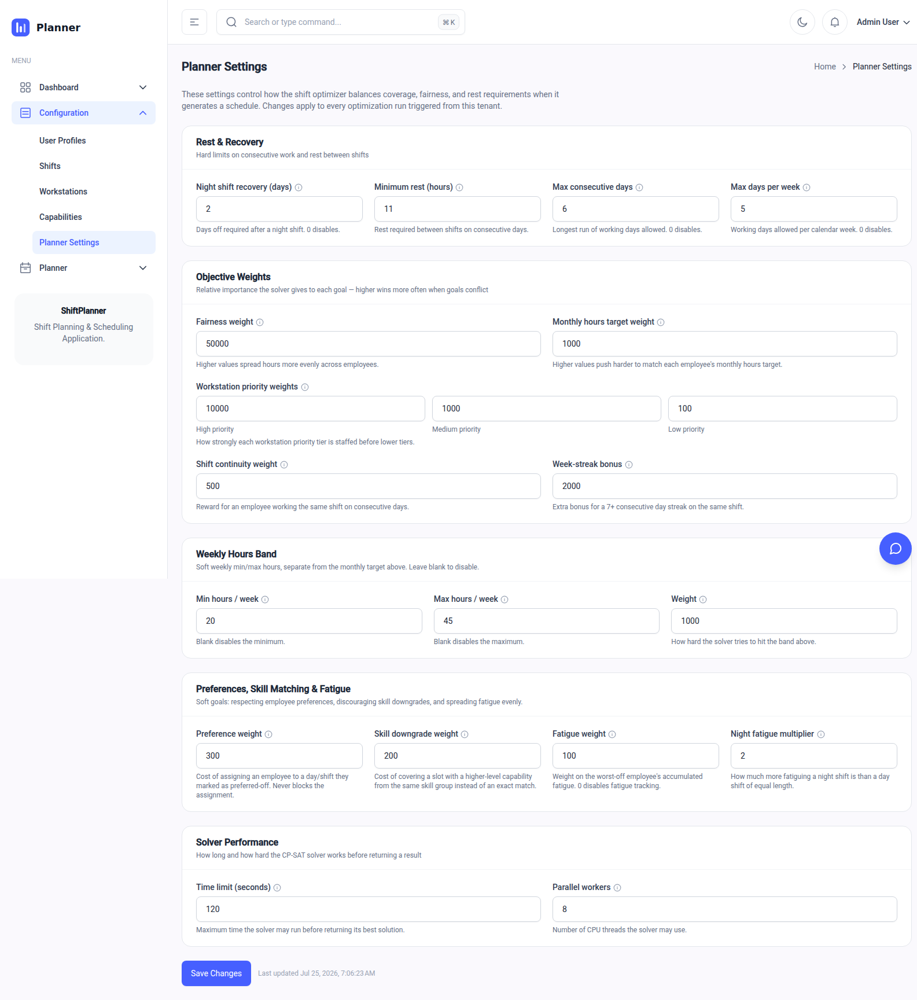

# How the automatic planner decides

You do not need to read this page to use the software. Read it when the
planner produces something you disagree with and you want to know why — or
when you want to change how it thinks.

## The short version

The planner is not clever, and it is not guessing. It works like an extremely
patient colleague who tries millions of rosters, throws away every one that
breaks a rule, gives each of the survivors a score, and hands you the best
one it found before the clock ran out.

So there are two kinds of thing you can tell it:

- **Rules it must never break.** These simply eliminate rosters.
- **Things it should try to do well.** These are scored, and the planner
  trades them off against each other.

Almost every surprise comes from the second kind. When two goals conflict —
and on a short-staffed ward they always do — the planner has to sacrifice one.
Which one it sacrifices is something you control.

---

## The rules it will never break

These come from your setup, not from a settings page. A roster violating any
of them is not produced at all.

| Rule | Where it comes from |
|---|---|
| Nobody works two shifts on the same day | Built in |
| Nobody works at two places in one shift | Built in |
| Nobody exceeds a workstation's **Max** staffing | [Workstation](setup.md#3-workstations) |
| Nobody exceeds a shift's **Max** staffing | [Shift weekday times](setup.md#weekday-times) |
| People only work shifts they are **available** for | [Employee](people.md#available-shifts) |
| People only work where they hold **every required capability** | [Employee](people.md#capabilities) / [Workstation](setup.md#3-workstations) |
| Nobody is scheduled on a **hard absence** | [Employee](people.md#leave-and-unavailability) |
| Closed workstations are not staffed | [Workstation unavailability](setup.md#3-workstations) |
| Compulsory rest days after a shift are honoured | *Free days after* on the shift |
| Minimum rest between two days' shifts | *Minimum rest (hours)* setting |
| The cap on consecutive working days | *Max consecutive days* setting |
| The cap on working days per week | *Max days per week* setting |

!!! important "Minimum staffing is not on this list"
    **Max** staffing is a hard rule; **Min** is a goal. If minimums were hard
    rules, one bad flu week would give you the word "impossible" and no
    roster. Instead the planner fills what it can, and the shortfall shows up
    as a thin day you can see and act on.

## The things it tries to do well

Everything below is scored. The planner adds up the scores of a candidate
roster and keeps the best total.

| Goal | What it means in practice |
|---|---|
| **Cover the posts** | Reach each workstation's minimum staffing. Weighted by the workstation's **priority**, so high-priority posts are filled first when staff run short. |
| **Be fair** | Spread working hours evenly. This is weighted very heavily — it is why the planner refuses to let one person absorb all the awkward shifts. |
| **Hit contracted hours** | Land each person near their monthly target. Going over and going under are penalised equally. |
| **Respect the weekly band** | If you set one, keep everyone between a minimum and maximum number of hours in any 7 days. |
| **Grant preferences** | Honour soft "rather not work" days and shift wishes. |
| **Don't waste seniority** | Avoid covering a junior post with a senior person, where you have set up skill groups and levels. |
| **Share out the hard shifts** | Track how tiring each person's schedule is — nights count double — and protect the *worst-off* person rather than the average. |
| **Keep shifts consistent** | Reward giving someone the same shift several days running, with a bonus for a full week. Rotating people daily is legal but horrible. |

Two of these deserve a note.

**Fairness is deliberately loud.** Its weight is far higher than most others,
which encodes a priority order: the planner will accept a slightly worse-covered
low-priority desk to avoid dumping a fortnight of nights on one person.

**Fatigue protects the worst-off, not the average.** An average-based measure
is perfectly happy to wreck one person's month as long as the team's mean
looks acceptable. This one is not.

---

## The settings page

**Configuration → Planner Settings.** These apply to every calculation from
now on, for your organisation.

!!! warning "Change one thing at a time"
    These settings interact. If you change four values and the next roster
    looks worse, you will have no idea which one did it. Change one,
    recalculate, compare, then move on.

### Rest & Recovery

Hard limits. These are the ones with legal and contractual weight.

| Setting | Default | What it does |
|---|---|---|
| **Night shift recovery (days)** | 2 | Days off compulsory after a night shift. `0` switches it off. |
| **Minimum rest (hours)** | 11 | Rest required between shifts on consecutive days. This is what prevents a late shift followed by an early one. `0` switches it off. |
| **Max consecutive days** | 6 | The longest run of working days anyone may be given. `0` switches it off. |
| **Max days per week** | 5 | Working days allowed per calendar week. `0` switches it off. |

Tightening any of these makes the roster harder to fill; tighten all four at
once on a thin ward and you may get *infeasible*.

### Objective Weights

The relative importance of the competing goals. Higher wins more often.

| Setting | Default | What it does |
|---|---|---|
| **Fairness weight** | 50000 | How hard to spread hours evenly. Raise it if the roster feels lopsided; lower it if fairness is costing you coverage. |
| **Monthly hours target weight** | 1000 | How hard to hit each person's contracted hours. |
| **Workstation priority weights** | 10000 / 1000 / 100 | How strongly `High`, `Medium` and `Low` priority workstations are staffed ahead of each other. The gaps between the three numbers are what matter, not their size. |
| **Shift continuity weight** | 500 | Reward for keeping someone on the same shift on consecutive days. Raise it if people are being rotated too often. |
| **Week-streak bonus** | 2000 | Extra reward for a full week on the same shift. |

!!! note "Why the numbers are so far apart"
    50000 against 100 is not sloppiness. The wide gaps make the goals
    effectively rank-ordered inside a single score: fairness beats fatigue
    almost every time. That means changing a weight by a factor of ten does
    not "tune" it slightly — it can change which goal wins outright.

### Weekly Hours Band

An optional soft floor and ceiling on hours in any 7-day window, separate from
the monthly target. Leave the fields blank to switch it off.

| Setting | What it does |
|---|---|
| **Min hours / week** | The floor. Blank disables it. |
| **Max hours / week** | The ceiling. Blank disables it. |
| **Weight** | How hard the planner tries to stay inside the band. |

Useful when the monthly target alone lets someone do 70 hours one week and 10
the next.

### Preferences, Skill Matching & Fatigue

| Setting | Default | What it does |
|---|---|---|
| **Preference weight** | 300 | The cost of overriding a soft "rather not work" day. It never blocks an assignment — for that, leave the absence hard. |
| **Skill downgrade weight** | 200 | The cost of covering a post with a more senior person from the same skill group, per level of difference. Only has an effect if you have set up skill groups. |
| **Fatigue weight** | 100 | How much the ergonomic burden counts. `0` switches fatigue tracking off. |
| **Night fatigue multiplier** | 2 | How much more tiring a night shift is than a day shift of the same length. |

### Solver Performance

| Setting | Default | What it does |
|---|---|---|
| **Time limit (seconds)** | 120 | How long the planner may search before handing back its best answer. |
| **Parallel workers** | 8 | How many processor threads it may use. Leave this alone unless your administrator tells you otherwise. |

**The time limit is the honest quality knob.** The planner returns the best
roster it found within the budget, so a status of *feasible* on a large ward
usually just means the timer expired. If a roster looks unpolished, raising the
limit to 300 seconds and recalculating is the first thing to try — it costs
nothing but a few minutes of waiting.

Press **Save Changes**. The timestamp beside the button shows when the settings
were last altered.

---

## Reading the outcome

| Symptom | Likely cause |
|---|---|
| A workstation is consistently thin | Not enough qualified people available, or its priority is too low relative to others |
| One person is doing all the nights | Very few people have the night shift ticked as available |
| People are rotated between shifts daily | Shift continuity weight too low relative to fairness |
| Somebody is well under their contracted hours | Their capabilities or available shifts don't match what you're staffing |
| Everyone is under their hours | The ward is over-staffed for the workload you described — or **Match monthly hours** was left off |

For problems rather than preferences, see [When something looks
wrong](troubleshooting.md).

---

!!! info "For the technically minded"
    Under the bonnet this is a constraint-programming model solved with Google
    OR-Tools' CP-SAT solver. The exact constraint formulation, the objective
    terms and their provenance in the nurse-scheduling literature are
    documented in [Optimizer](../planner.md).
