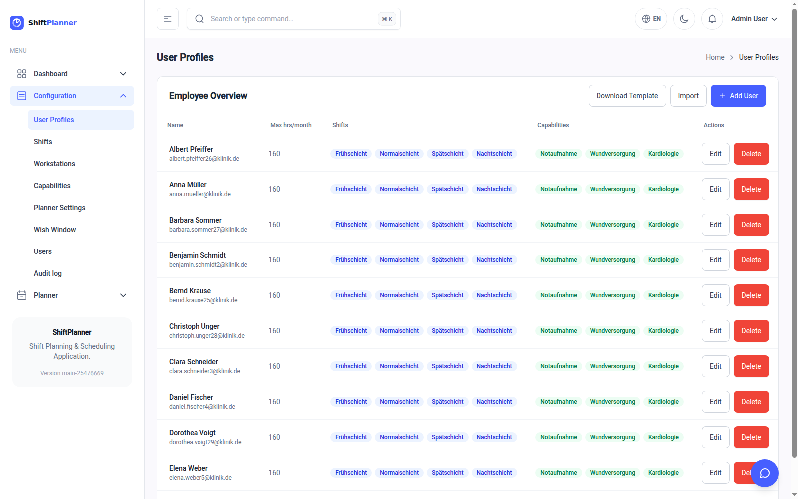
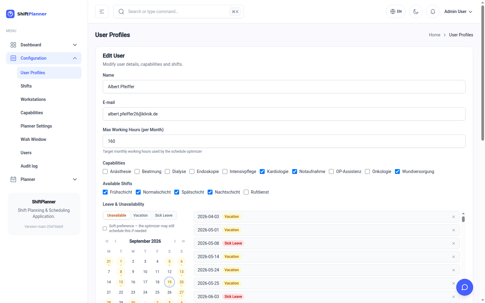
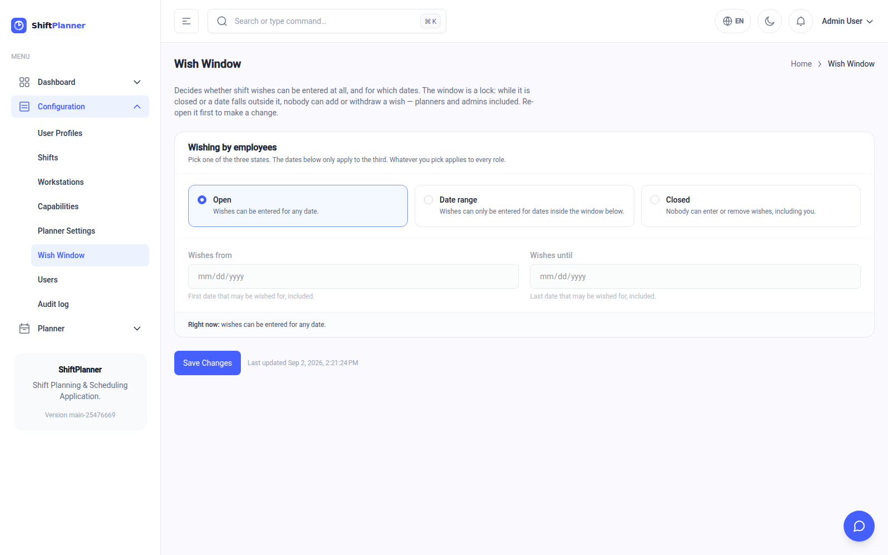

# Managing your staff

This is the screen you will come back to most often. Everything the planner
knows about a person lives here: what they're qualified for, which shifts they
work, and when they're away.

Open **Configuration → User Profiles**.

The list shows, at a glance, every person's monthly hours target, the shifts
they work and the qualifications they hold. Press **Add User** for a new
colleague, or **Edit** on anyone already listed.

!!! note "An employee is not a login"
    This list is who works on the ward. Whether any of them can *sign in*, and
    what they may press if they do, is a separate question — see [Users, roles
    and history](administration.md). The two are joined by the e-mail address,
    so use the same one on both.

## The employee form

### Name, email and hours

| Field | What to put in it |
|---|---|
| **Name** | The person's name as it should appear on the roster. |
| **Email** | Their work address. Also how the system recognises them if they log in themselves. |
| **Max working hours (per month)** | Their contracted monthly hours. |

The hours figure is a **target, not a ceiling**. The planner tries to land
each person near their number and treats going over and going under as equally
bad. Someone at 160 hours will be given roughly twice as much work as a
part-timer at 80 — that is the main mechanism by which part-time contracts are
respected.

### Capabilities

Tick every qualification the person actually holds.

This is what makes them eligible for workstations. A workstation requiring
*Intensive care* and *Ventilation* is open only to people with **both** ticked.

Be accurate here rather than generous. An untidy capability list is the single
most common reason a roster comes back thin.

### Available shifts

Tick the shift types this person works **at all**.

This is the contractual answer, not a weekly preference. Somebody on a
day-only contract has the night shift unticked, permanently. Somebody who is
simply hoping for early shifts next week should have all their shifts ticked —
use a [shift wish](#shift-wishes) instead.

### Leave and unavailability

The bottom half of the form is a calendar. Click a day to mark it; the entries
appear in the list on the right, where you can remove them again.

Pick the kind of absence with the tabs above the calendar:

| Tab | Use it for |
|---|---|
| **Unavailable** | Any day the person cannot work — courses, secondments, parental duties. |
| **Vacation** | Approved annual leave. |
| **Sick Leave** | Recorded sickness. |

The three appear in different colours across the calendars, so you can tell a
holiday from an illness at a glance.

#### Hard absence vs. a preference

Beneath the tabs is a checkbox: **"Soft preference — the optimizer may still
schedule this if needed"**.

- **Left unticked** (the normal case) — the day is *blocked*. The planner will
  not schedule this person, whatever the consequences. This is what "I am on
  holiday" means.
- **Ticked** — the day is a *wish to be off*. The planner will avoid it, and
  will only override it if the alternative is leaving a post unstaffed. This
  is what "I'd rather not work that Saturday" means.

Getting this distinction right matters. Marking every preference as a hard
absence gradually makes the roster impossible to fill; marking real holidays as
soft means someone may be rostered while they are abroad.

---

## Shift wishes

A **shift wish** is the positive version: *"I'd like the early shift on the
14th."*

Wishes are set from the **Employee Calendar**, not the employee form. Open
**Planner → Employee Calendar**, choose the person, and click an empty day.

The menu has three parts:

| Section | What it does |
|---|---|
| **Assign shift** | Puts the person on that shift, definitively. This is a decision, not a request. |
| **Wish shift (optimizer)** | Records a *preference* for that shift. The planner is rewarded for granting it but is free to decide otherwise. |
| **Workstation** | Sets where the assignment applies. |

Wishes show up as an outlined star-marked chip on the calendar, so a granted
wish and a plain assignment are distinguishable. Hover over one and a small
delete button appears.

!!! tip "Collecting wishes before you plan"
    The natural rhythm is: gather requests during the month, enter them as
    wishes and soft preferences, then calculate the next roster. The planner
    grants as many as it can and tells you nothing about the ones it couldn't
    — so a quick scan of the finished roster is still worth your time.

### When staff may wish: the wish window

Staff who sign in themselves (the **shift-viewer** role) enter their own wishes
on this same calendar. Whether they can, and for which days, is set once per
ward under **Configuration → Wish Window** — a page only the **shift-admin**
role sees.

| State | What can be wished |
|---|---|
| **Open** | Any day. |
| **Date range** | Only days inside the range you set — the usual way to collect wishes for one month and then stop. |
| **Closed** | Nothing. |

Pick a state, set the two dates if you chose *Date range*, and press **Save
Changes**. A line under the choices spells out what staff will experience.

On the Employee Calendar a note at the top says what is currently allowed, and
the *Wish shift* option simply is not offered on days outside the window —
including the delete button on a wish already placed, so a wish cannot be
withdrawn after the deadline.

The window applies to **you too**. While it is closed — or for a day outside the
range — nobody adds or withdraws a wish, admins included, and the calendar offers
no *Wish shift* option to anyone. A late request phoned in after the deadline
means re-opening the window, entering it, and closing it again; the reopening is
recorded in the audit log.

That is the point of it: once wishes are locked, what the planner sees is what
staff asked for, and nobody can quietly slip one in afterwards.

---

## Keeping the list tidy

A few habits that pay off:

- **Record sickness as it happens.** A roster calculated on Monday cannot know
  about Tuesday's absence, but a plan recalculated on Wednesday will work
  around it.
- **Review capabilities after training.** Newly qualified staff stay invisible
  to the planner until someone ticks the box.
- **Don't delete people who leave — until the plans referring to them no
  longer matter.** Historical rosters reference them.

## Next

Your data is in place. Go to [Creating a schedule](creating-a-plan.md).
