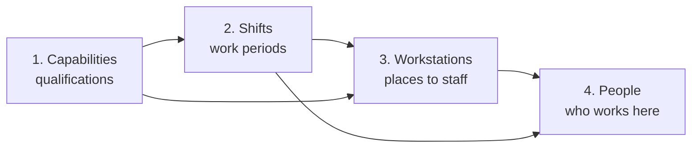
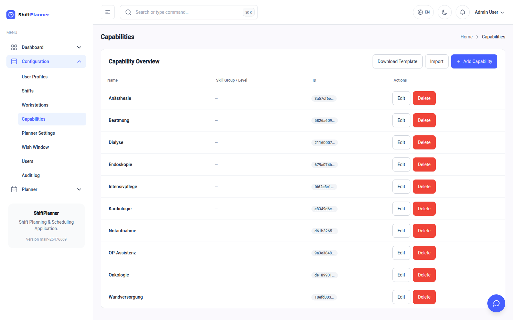
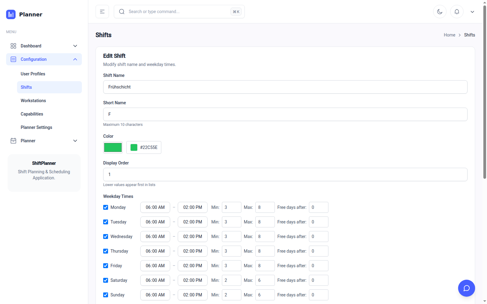
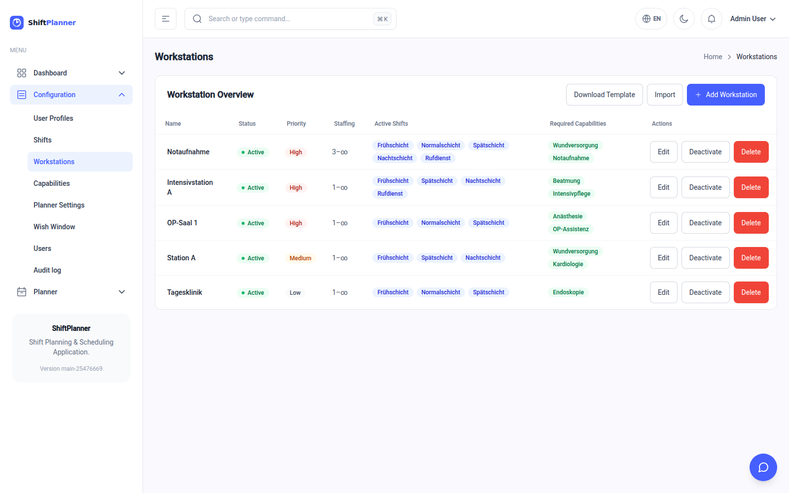
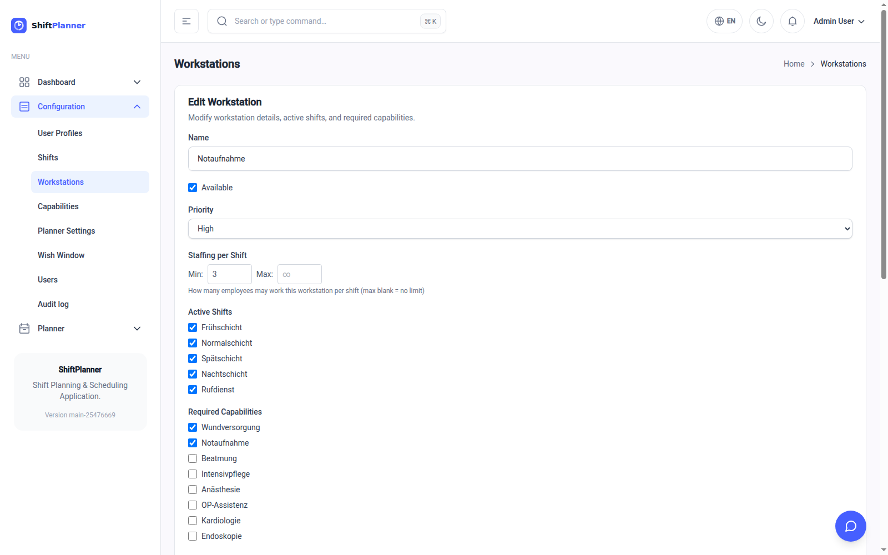

# Setting up your ward

This is the one-time job of teaching the software what your ward looks like.
It takes an afternoon. After that you only touch these screens when something
real changes — a new qualification, a reorganised unit, different shift times.

Everything here lives under **Configuration** in the left-hand menu.

## Do it in this order

Each step needs the one before it, so work top to bottom:

1. **Capabilities** — the qualifications that exist on your ward.
2. **Shifts** — the work periods, and when they run.
3. **Workstations** — the places that need staffing, what they require, and
   how many people.
4. **People** — your staff, and what each of them is qualified and available
   for. Covered separately in [Managing your staff](people.md).

---

## 1. Capabilities

A **capability** is a qualification, skill or licence: *Intensive care*,
*Emergency room*, *Anaesthesia*, *Wound care*. It is the link between "what a
place needs" and "what a person can do".

Press **Add Capability** and give it a name. That is all most wards ever need.

### Skill group and level (optional)

Two extra fields let you say that some qualifications are *ranked versions of
the same thing* — for instance a junior, a senior and a lead nurse.

- **Skill group** — a short label shared by the ranked qualifications, e.g.
  `nursing`. Leave it blank if the qualification doesn't have tiers.
- **Skill level** — a number, where higher means more senior. Default `1`.

When you fill both in, the planner is allowed to cover a junior post with a
senior person if it has to, but it will avoid doing so — so your senior staff
don't get quietly used up on work anyone could have done. Leave these blank
and nothing changes.

!!! tip "Keep the list short"
    Only create a capability if it genuinely decides *who may work where*.
    Every extra one narrows the pool of eligible people and makes the roster
    harder to fill.

---

## 2. Shifts

A **shift** is a named work period — *Early*, *Late*, *Night*, *On call*.

Press **Add Shift**, or **Edit** on an existing one.

| Field | What to put in it |
|---|---|
| **Shift name** | The full name, as staff know it. |
| **Short name** | A one- or two-letter abbreviation (max 10 characters). This is what appears in the calendar squares, so keep it tiny. |
| **Colour** | The colour used for this shift everywhere in the app. Pick clearly distinct colours — you will be reading these at a glance. |
| **Display order** | Controls the order shifts appear in lists. Lower numbers come first. Number them in the order of the working day. |

### Weekday times

Below that, one row per weekday. **Untick a weekday and the shift does not run
that day** — that is how you model a service that doesn't operate at the
weekend.

| Column | Meaning |
|---|---|
| **Start / End** | When the shift runs *on that weekday*. An end time earlier than the start means it crosses midnight — a night shift from 22:00 to 06:00 is entered exactly like that. |
| **Min** | How many people you want on this shift. The planner treats this as a **target**: it tries hard to reach it, and shows you the shortfall if it can't. |
| **Max** | The ceiling. The planner will **never** exceed it. |
| **Free days after** | How many days off are compulsory after working this shift. Set `2` on your night shift to enforce the usual recovery rule. |

!!! info "Why Min is a target but Max is absolute"
    If a minimum were absolute, a week when three people call in sick would
    produce nothing at all — just the word "impossible", which helps nobody.
    Instead you get the best roster achievable, with the gap visible. A
    maximum, on the other hand, is usually a real limit (space, equipment,
    budget), so it is enforced strictly.

### Weekends and reduced service

Note in the screenshot that Saturday and Sunday have a lower Min and Max than
weekdays. That is the normal way to model a reduced weekend service: same
shift, different staffing band.

---

## 3. Workstations

A **workstation** is a place that has to be staffed: a ward, a theatre, a
unit, a desk.

| Field | What to put in it |
|---|---|
| **Name** | What people on the ward call it. |
| **Available** | Untick to take the workstation out of planning entirely without deleting it and losing its history. |
| **Priority** | `High`, `Medium` or `Low`. When there are not enough people to go round, high-priority workstations are staffed first. |
| **Staffing per shift — Min / Max** | How many people work here in one shift. Leave **Max** blank for "no limit". |
| **Active shifts** | Which shifts operate here. A day clinic that never runs nights simply has the night shift unticked. |
| **Required capabilities** | The qualifications someone must hold to work here. **All** of them, not any of them. |
| **Closed periods** | Date ranges when the workstation is closed — refurbishment, seasonal closure, summer shutdown. |

### Deactivating a workstation

**Deactivate** in the workstation's row (or right-click the row) asks how:

- **For a period** — pick the first and last closed day. The workstation is left
  out of planning on those days and reopens by itself afterwards. Periods of one
  workstation may not overlap.
- **Completely** — out of planning until you press **Reactivate**. Its history
  stays.

The **Status** column shows where each workstation stands today — *Active*,
*Closed until …* or *Deactivated* — and a closure that is booked but has not
started yet. On a closed day the schedule shows the workstation's cells as
*Closed*, and neither the schedule nor the dashboard counts it as understaffed.

A closed workstation cannot be picked when you edit the roster by hand, and
**Take as Plan** refuses a proposal that still staffs one — say, because it was
calculated before the closure was entered. Calculate again, or move those
people in the proposal first. People already rostered there before the closure
stay where they are; the schedule marks their day *Closed* so you can move them.

!!! danger "Required capabilities are the most common cause of trouble"
    Ticking four required capabilities on a workstation means only staff
    holding **all four** may ever be assigned there. That is often nobody. If
    a workstation stubbornly comes back understaffed, this is the first place
    to look. See [When something looks wrong](troubleshooting.md).

### Getting priority right

Priority decides who loses out when the ward is short-staffed, so it is worth
a moment's thought:

- **High** — must be staffed. Emergency, intensive care, theatres in use.
- **Medium** — normal wards.
- **Low** — desirable but postponable. Outpatient desks, day clinics.

If everything is `High`, priority tells the planner nothing and it will spread
the shortage evenly instead of protecting your critical posts.

---

## Loading data from Excel

Capabilities, shifts, workstations and staff can all be loaded in bulk rather
than typed in one at a time. On each of those pages:

1. Press **Download Template** — you get an `.xlsx` file with the right
   columns and headings already in place.
2. Fill it in, one row per item, using any spreadsheet program.
3. Press **Import** and choose your file.

Use the downloaded template rather than building your own spreadsheet; the
column names have to match exactly.

!!! tip "Import is how you move a paper ward into the system"
    If you already keep your staff list in a spreadsheet, exporting it into
    the employee template is far quicker — and less error-prone — than typing
    forty people in by hand.

---

## Next

With qualifications, shifts and workstations described, move on to
[Managing your staff](people.md).
