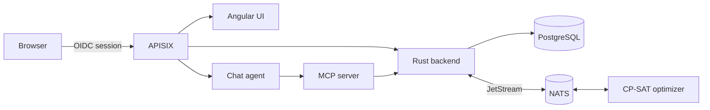

# Shift Planner

Shift Planner is a hospital staffing system for planning ward coverage while
respecting qualifications, rest rules, monthly hour targets, shift wishes and
workstation priorities. It is designed for ward managers, staffing coordinators,
planners and administrators who need a safe, auditable roster that can be
reviewed before it becomes the official plan.

The system does not decide the schedule for you in secret. It proposes a
legally consistent roster, highlights shortages, keeps the fixed patterns you
choose, and lets a planner review and adjust the result before pressing
**Take as Plan**.

## The four services

| Service | Language | Role |
|---|---|---|
| **Backend** | Rust (Axum + Diesel) | REST API, PostgreSQL persistence, tenant isolation, audit trail |
| **Planner** | Python (OR-Tools CP-SAT) | Solves the scheduling problem; reachable over HTTP or NATS JetStream |
| **UI** | Angular 21 + Tailwind | Calendars, configuration screens, scheduling workbench |
| **Agent / MCP** | Python (LangGraph + FastMCP) | Chat assistant that drives the app through MCP tools generated from the OpenAPI spec |

They sit behind an APISIX gateway that terminates OIDC against Keycloak, and
run on PostgreSQL and NATS. Every API call is tenant-scoped and role-checked,
so a viewer can see schedules but cannot edit them, a planner can calculate and
modify proposals, and an admin can manage users and the shift-wish window.

## Where to go next

!!! tip "Using the software rather than building it?"
    Start with the **[User Guide](guide/index.md)** — a non-technical,
    illustrated walkthrough of every screen, written for ward managers and
    staffing coordinators. Everything below is documentation for developers
    and administrators.

- **[User Guide](guide/index.md)** — what the software is for and how to run a
  ward with it, screen by screen.
- **[Architecture](architecture.md)** — how the pieces fit together and how a
  plan flows through them.
- **[Getting Started](getting-started.md)** — run the whole stack locally.
- **[Domain Model](domain-model.md)** — employees, shifts, capabilities,
  workstations and plans.
- **[REST API](api.md)** — every endpoint the backend exposes.
- **[Optimizer](planner.md)** — the constraint model and its tunable weights.
- **[Agent & MCP](agent.md)** — the chat assistant and the generated tool surface.
- **[Auth & Multi-Tenancy](auth.md)** — how a request is scoped to a tenant.
- **[Deployment](deployment.md)** — Docker Compose, the registry, and CI.

## Status of this documentation

These pages describe the system as it stands in the `main` branch. The
authoritative sources are `api/openapi.yaml` for the HTTP surface,
`src/schema.rs` and `migrations/` for the data model, and
`planner/shift_planner/models.py` for the optimizer's input contract — where
this documentation and those files disagree, the files win.
