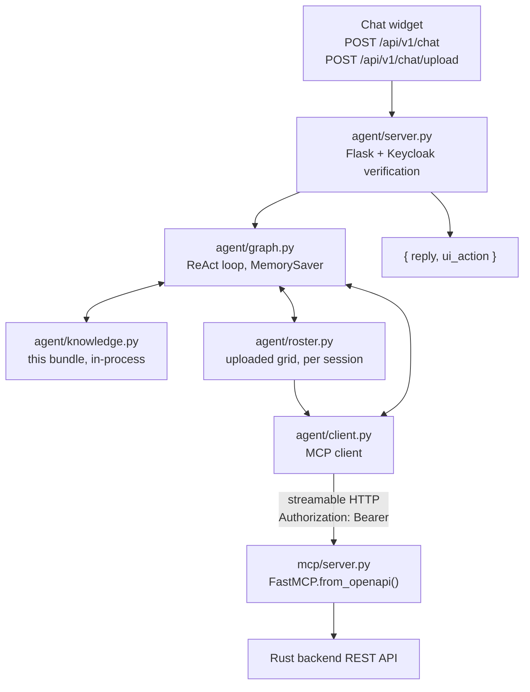

`agent/` holds a LangGraph chat agent that lets signed-in users drive the app by
talking to it, and the MCP server it calls to get anything done.

**The agent has no backend tools of its own.** Everything that reads or writes
system state comes from the MCP server, generated from `api/openapi.yaml` at
startup — see [Spec-driven tool surface](/architecture/spec-driven-tool-surface.md).

Its main local capability is *this bundle*: three read-only tools over
`docs/knowledge`, so questions about how the product works are answered from
written documentation rather than from the model's own recollection. State comes
from the API; explanation comes from here.

The other local capability is the roster upload — reading a shift plan out of a
file the user attached. Its writes still go through MCP; the local part exists
because the file's *grid* must not pass through the model, only the layout the
model declares for it.



# shift_agent/agent — the chat agent

| File | Role |
|---|---|
| `graph.py` | The ReAct loop: the `agent` node calls the LLM, the `tools` node runs what it asked for, repeat until a plain-text answer. History per `session_id` in LangGraph's in-memory `MemorySaver`. |
| `client.py` | Lists the MCP server's tools at startup and wraps each as a LangChain `StructuredTool`. |
| `knowledge.py` | The agent's own tools over this bundle — `searchKnowledge`, `readKnowledgeDoc`, `listKnowledgeTopics`. |
| `documents.py` | Reduces an uploaded PDF/CSV/XLSX to sheets of cell strings. Interprets nothing. |
| `roster.py` | `previewRosterUpload` / `interpretRosterUpload` / `applyRosterUpload`, over a per-session store of uploaded grids. |
| `server.py` | HTTP surface. Verifies the caller's token against Keycloak's JWKS, then stores it in a contextvar for the duration of the call. |
| `auth.py` | Keycloak verification plus the contextvar holding the token. |

The roster tools follow the same rule the rest of the agent does. The model
supplies only a *layout* — which column holds the names, which row the dates,
which month, which codes mean a day off — and `roster.py` expands that into the
hundreds of assignments the grid implies, deterministically, in Python. Those go
to `POST /shift-assignments/import` through the MCP client, first with `dry_run`
so the agent can show its reading and ask, then for real once the user agrees.
See [Importing a roster](/guide/importing-a-roster.md) for the user's view and
[Shift assignment](/concepts/shift-assignment.md) for what gets created.

One design point worth understanding: `client.py` opens a **fresh short-lived MCP
session per tool call**. A long-lived session would fix its headers at connect
time, but the graph is a process-wide singleton shared by every user — so the
session must be created per call to carry the right user's token.

# shift_agent/mcp — the MCP server

`server.py` builds the tool surface with `FastMCP.from_openapi()`. The one
hand-written tool is `navigate`, which has no REST equivalent: it targets the
browser, and `agent/server.py` turns it into a `ui_action` in the chat response.
Navigable pages are listed in `KNOWN_PAGES`.

Usable directly by any MCP client:

```bash
uv run shift-agent mcp                                # stdio
uv run shift-agent mcp --transport http --port 8900   # streamable HTTP
claude mcp add shift-backend -- uv --directory /path/to/backend/agent run shift-agent mcp
```

# LLM providers

Selected with `SHIFT_AGENT_LLM_PROVIDER`:

| Provider | Value | Example models | Key |
|---|---|---|---|
| Ollama (local) | `ollama` | `llama3.2`, `qwen2.5`, `mistral` | — |
| Ollama.com | `ollama-com` | `llama3.2-70b`, `qwen2.5-72b-instruct` | `OLLAMA_COM_API_KEY` |
| OpenAI | `openai` | `gpt-4o`, `gpt-4o-mini` | `OPENAI_API_KEY` |

`MCP_TOOLS` narrows what the model sees to a comma-separated allowlist. Worth
setting for small local models, which choose badly from all ~70 backend
operations. Unset means everything. The knowledge tools are not affected — that
allowlist covers MCP tools only.

# The knowledge tools

`knowledge.py` loads this bundle once when the graph is built and holds it in
memory. Every document's frontmatter (`title`, `type`, `description`, `tags`) is
parsed out and indexed alongside its headings and body.

| Tool | Use |
|---|---|
| `searchKnowledge` | Keyword search; returns the best-matching documents with path, title, description and a snippet. |
| `readKnowledgeDoc` | One document in full, by bundle path — `concepts/shift.md`, with or without the leading `/` used in this bundle's own links. |
| `listKnowledgeTopics` | The whole catalogue: every path, title and description. |

Retrieval is TF-IDF over those fields with crude suffix stemming, not embeddings.
At ~50 curated documents the frontmatter carries the signal, and the inverse
document frequency matters more than the similarity model: "shift" appears in
nearly every document here and must count for almost nothing, or every question
lands on whichever page says it most often.

The bundle root is fixed **at startup**, first match winning:

1. `--knowledge-path` on `shift-agent api` / `shift-agent chat`
2. `SHIFT_AGENT_KNOWLEDGE_PATH`
3. `docs/knowledge` resolved relative to the installed package — inside
   `deploy/Dockerfile.agent` that is `/docs/knowledge`, where the image copies
   the bundle and `docker-compose.yml` pins the variable.

A path with no documents is not fatal: the tools are simply not bound, the agent
keeps its MCP tools, and startup logs a warning. To see what a running agent
actually has:

```bash
shift-agent knowledge                              # list every document
shift-agent knowledge "why is the plan infeasible" # what searchKnowledge returns
docker compose exec agent shift-agent knowledge    # …inside the container
```

# Chat API

```bash
curl -X POST http://localhost:8899/api/v1/chat \
  -H "Content-Type: application/json" \
  -H "Authorization: Bearer $TOKEN" \
  -d '{"message": "take me to the planner settings page"}'
```

```json
{
  "session_id": "default",
  "reply": "...",
  "ui_action": {"action": "navigate", "path": "/planner-settings"}
}
```

With no Keycloak configured (`KEYCLOAK_JWKS_URL` / `KEYCLOAK_REALM_URL` unset)
the endpoint accepts unauthenticated requests — development only.

# The token chain

The signed-in user's token travels the whole way, so every call runs as that user
under that user's tenant. The agent has no privileges of its own. Full chain in
[Gateway and identity](/architecture/gateway-and-identity.md).

# Running and extending

```bash
cd agent && make install && cp .env.example .env
make mcp-http     # MCP server on :8900 — start this first
make api          # chat API on :8899
make chat         # or a terminal session
```

Outside Docker set `MCP_SERVER_URL=http://localhost:8900/mcp`; the default targets
the `mcp` Compose service. If the MCP server isn't up the first chat request
returns 503 and the next retries.

| Goal | What to do |
|---|---|
| New backend capability | Add it to `api/openapi.yaml` and the backend; the MCP server picks it up automatically |
| New navigable page | Add it to `KNOWN_PAGES` **and** `ui/src/app/app.routes.ts` |
| Something the assistant explains wrongly | Fix or add the document here in `docs/knowledge`; nothing in the agent changes |
| Persistent history | Swap `MemorySaver` for `SqliteSaver` or `PostgresSaver` in `graph.py` |
| Streaming replies | Use `graph.astream(...)` instead of `graph.ainvoke(...)` |

`mcp` is not a separate image: Compose runs the `agent` image with a different
command.
