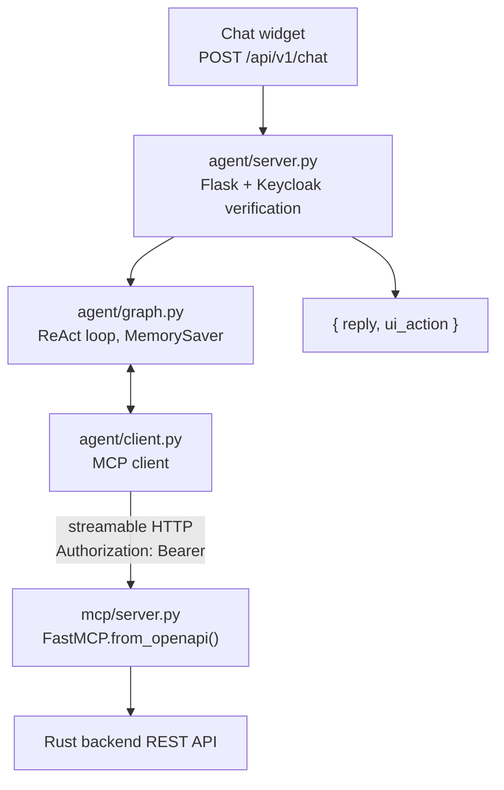

`agent/` holds a LangGraph chat agent that lets signed-in users drive the app by
talking to it, and the MCP server it calls to get anything done.

**The agent has no backend tools of its own.** Every capability comes from the
MCP server, generated from `api/openapi.yaml` at startup — see
[Spec-driven tool surface](/architecture/spec-driven-tool-surface.md).



# shift_agent/agent — the chat agent

| File | Role |
|---|---|
| `graph.py` | The ReAct loop: the `agent` node calls the LLM, the `tools` node runs what it asked for, repeat until a plain-text answer. History per `session_id` in LangGraph's in-memory `MemorySaver`. |
| `client.py` | Lists the MCP server's tools at startup and wraps each as a LangChain `StructuredTool`. |
| `server.py` | HTTP surface. Verifies the caller's token against Keycloak's JWKS, then stores it in a contextvar for the duration of the call. |
| `auth.py` | Keycloak verification plus the contextvar holding the token. |

One design point worth understanding: `client.py` opens a **fresh short-lived MCP
session per tool call**. A long-lived session would fix its headers at connect
time, but the graph is a process-wide singleton shared by every user — so the
session must be created per call to carry the right user's token.

# shift_agent/mcp — the MCP server

`server.py` builds the tool surface with `FastMCP.from_openapi()`. The one
hand-written tool is `navigate`, which has no REST equivalent: it targets the
browser, and `agent/server.py` turns it into a `ui_action` in the chat response.
Navigable pages are listed in `KNOWN_PAGES`.

Usable directly by any MCP client:

```bash
uv run shift-agent mcp                                # stdio
uv run shift-agent mcp --transport http --port 8900   # streamable HTTP
claude mcp add shift-backend -- uv --directory /path/to/backend/agent run shift-agent mcp
```

# LLM providers

Selected with `SHIFT_AGENT_LLM_PROVIDER`:

| Provider | Value | Example models | Key |
|---|---|---|---|
| Ollama (local) | `ollama` | `llama3.2`, `qwen2.5`, `mistral` | — |
| Ollama.com | `ollama-com` | `llama3.2-70b`, `qwen2.5-72b-instruct` | `OLLAMA_COM_API_KEY` |
| OpenAI | `openai` | `gpt-4o`, `gpt-4o-mini` | `OPENAI_API_KEY` |

`MCP_TOOLS` narrows what the model sees to a comma-separated allowlist. Worth
setting for small local models, which choose badly from all ~70 backend
operations. Unset means everything.

# Chat API

```bash
curl -X POST http://localhost:8899/api/v1/chat \
  -H "Content-Type: application/json" \
  -H "Authorization: Bearer $TOKEN" \
  -d '{"message": "take me to the planner settings page"}'
```

```json
{
  "session_id": "default",
  "reply": "...",
  "ui_action": {"action": "navigate", "path": "/planner-settings"}
}
```

With no Keycloak configured (`KEYCLOAK_JWKS_URL` / `KEYCLOAK_REALM_URL` unset)
the endpoint accepts unauthenticated requests — development only.

# The token chain

The signed-in user's token travels the whole way, so every call runs as that user
under that user's tenant. The agent has no privileges of its own. Full chain in
[Gateway and identity](/architecture/gateway-and-identity.md).

# Running and extending

```bash
cd agent && make install && cp .env.example .env
make mcp-http     # MCP server on :8900 — start this first
make api          # chat API on :8899
make chat         # or a terminal session
```

Outside Docker set `MCP_SERVER_URL=http://localhost:8900/mcp`; the default targets
the `mcp` Compose service. If the MCP server isn't up the first chat request
returns 503 and the next retries.

| Goal | What to do |
|---|---|
| New backend capability | Add it to `api/openapi.yaml` and the backend; the MCP server picks it up automatically |
| New navigable page | Add it to `KNOWN_PAGES` **and** `ui/src/app/app.routes.ts` |
| Persistent history | Swap `MemorySaver` for `SqliteSaver` or `PostgresSaver` in `graph.py` |
| Streaming replies | Use `graph.astream(...)` instead of `graph.ainvoke(...)` |

`mcp` is not a separate image: Compose runs the `agent` image with a different
command.
