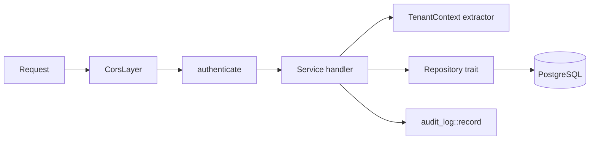

Axum 0.7 for transport, Diesel 2.1 for persistence, a middleware layer that
resolves the tenant before any handler runs. The only writer of persistent state
in the system.

# Source layout

```
src/
├── main.rs          CLI (clap): `serve` and its flags
├── lib.rs           library exports
├── server.rs        router, CORS, tenant middleware, startup tasks
├── config.rs        Figment configuration + CliArgs
├── database.rs      r2d2 connection pool
├── broker.rs        NATS connection, JetStream stream setup
├── errors.rs        AppError and its IntoResponse mapping
├── schema.rs        Diesel schema (generated — never edited by hand)
├── models/          row structs, request/response DTOs, optimizer task DTOs
├── repository/      Diesel queries behind async traits (domain.rs)
└── services/        Axum handlers and business rules
```

# Layering

Handlers hold no SQL; repositories hold no HTTP.

| Layer | Location | Responsibility |
|---|---|---|
| Transport | `src/server.rs` | Router, CORS, tenant middleware |
| Services | `src/services/` | Handlers, validation, business rules, audit logging |
| Repositories | `src/repository/` | Diesel queries behind async traits in `domain.rs` |
| Models | `src/models/` | Row structs, DTOs, optimizer task DTOs |

`AppState` carries the connection pool, the optional NATS client, the tenant
defaults and one **boxed repository trait object per aggregate**. That indirection
is what lets handler tests run against in-memory fakes with no database;
`tower-test` drives the router directly.

Two repository conventions:

1. **Tenant first.** Every method's first parameter is `tenant_id` — see
   [Tenant isolation](/architecture/tenant-isolation.md).
2. **Blocking work off the async thread.** Diesel is synchronous, so repositories
   run queries on a blocking pool rather than stalling the Tokio runtime.

# Request lifecycle



`authenticate` wraps the entire `/api/v1` subtree, so no handler is reachable
without a tenant having been established. It also enforces realm roles against
the request method and answers **403** otherwise. `/health` sits outside the nest
and needs no auth.

# Services

| Module | Covers |
|---|---|
| `employee.rs` | CRUD, capability and available-shift links, XLSX import/export |
| `shift.rs` | CRUD plus per-weekday times |
| `capability.rs` | CRUD and import |
| `workstation.rs` | CRUD, enable/disable, availability, required capabilities |
| `workstation_unavailability.rs` | Workstation closure ranges |
| `unavailability.rs` | Employee absences and soft preferences |
| `shift_assignment.rs` | Fixed pre-assignments |
| `shift_wish.rs` | Employee shift wishes |
| `confirmed_shift_plan.rs` | The approved schedule |
| `optimizer.rs` | Planning tasks, NATS publish/subscribe, results |
| `planner_settings.rs` | Per-tenant solver configuration |
| `analysis.rs` | Aggregate reporting endpoints |
| `audit_log.rs` | Writing and reading the audit trail |
| `auth.rs` | `/self` — decodes the gateway's `X-Userinfo` header |
| `tenant.rs` | Tenant middleware and extractor |
| `xlsx_io.rs` | Shared spreadsheet helpers |

# Error mapping

`AppError` in `src/errors.rs`:

| Variant | Status |
|---|---|
| `Validation(String)` | 400, with the message |
| `NotFound` | 404 |
| `Internal` | 500, details logged rather than returned |

# NATS integration

`broker::connect` opens the client and tries to create the `SCHEDULING` stream
over subject `scheduling`. **If that fails the connection is still returned**,
flagged `JetStreamStatus::Unavailable`, and the service falls back to plain
publish. A NATS server without JetStream degrades the delivery guarantee; it does
not take the API down.

`optimizer::start_result_subscriber` runs for the process lifetime consuming
`scheduling.results`. See [NATS subjects](/interfaces/nats-subjects.md).

# Startup sequence

1. Load configuration (defaults → `config.yaml` → env → CLI flags).
2. Build the connection pool and run **embedded** migrations.
3. Connect to NATS; record whether JetStream is available.
4. Mark planning tasks older than three hours and still `scheduled` as failed.
5. Start the result subscriber.
6. Bind and serve.

Migrations being embedded and applied at startup means there is no separate
migrate step in normal operation — see
[Database and migrations](/operations/database-and-migrations.md).

# Related

* [REST API](/interfaces/rest-api.md), [XLSX import and export](/interfaces/xlsx-import-export.md)
* [Backend configuration](/operations/backend-configuration.md)
* Testing: `make test` (cargo test), `make check` (cargo check); tests live in `tests/`
