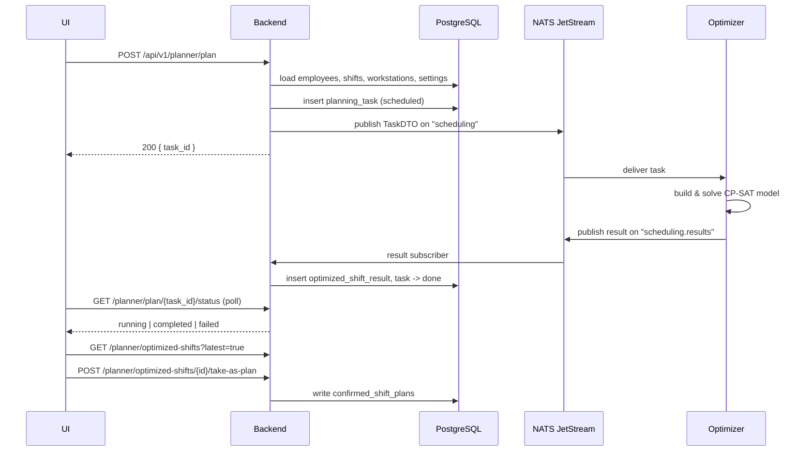

Optimization is asynchronous. `POST /planner/plan` returns immediately with a task
id; the result arrives later over NATS.

# The stages

| Stage | What happens | Concept |
|---|---|---|
| 1. Assemble | The backend reads the tenant's employees, shifts, workstations, absences, wishes and settings and builds a `TaskDTO` | [Optimizer contract](/interfaces/optimizer-contract.md) |
| 2. Record | A `planning_tasks` row is inserted as `scheduled` | [Planning task](/concepts/planning-task.md) |
| 3. Publish | The payload goes onto the `scheduling` subject | [NATS subjects](/interfaces/nats-subjects.md) |
| 4. Solve | The optimizer builds and solves the CP-SAT model | [Constraint model](/solver/constraint-model.md) |
| 5. Return | The result is published on `scheduling.results` | — |
| 6. Store | The subscriber writes an `optimized_shift_results` row and advances the task | [Optimized shift result](/concepts/optimized-shift-result.md) |
| 7. Adopt | A human calls `take-as-plan` | [Confirmed shift plan](/concepts/confirmed-shift-plan.md) |

# Details worth knowing

**`POST /planner/prepare` is the debugging tool.** It builds and returns the exact
same `TaskDTO` the backend would publish, without solving anything. When the
question is *"why did the solver see it that way"*, start here rather than
reasoning about the database.

**Task states have two vocabularies.** Stored as `scheduled` / `done` / `error`,
reported to clients as `running` / `completed` / `failed`.

**Stale tasks are reaped at startup.** Anything left in `scheduled` for more than
three hours is marked failed when the server next starts.

**No JetStream, no problem.** If stream creation fails at connect time the broker
falls back to plain publish, which the optimizer's HTTP mode can still serve. No
broker at all is different: `POST /planner/plan` fails with 500.

**Nothing is confirmed automatically.** A result is a proposal. It changes nothing
until someone calls `take-as-plan`, which then overwrites the confirmed roster for
the *whole period the result covers* — including hand edits made in that window.

# Related

* Driving it from the UI: [Creating a schedule](/guide/creating-a-schedule.md)
* When it returns nothing: [Infeasibility playbook](/solver/infeasibility-playbook.md)
* The endpoints: [REST API](/interfaces/rest-api.md)
