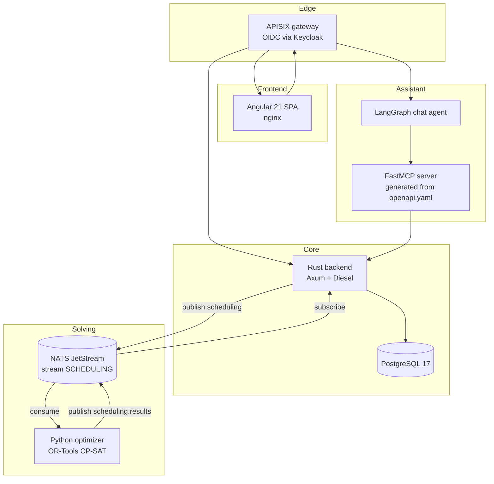

# The services

| Service | Language | Role | Concept |
|---|---|---|---|
| Backend | Rust (Axum + Diesel) | REST API, persistence, tenant isolation, audit trail | [Backend service](/architecture/backend-service.md) |
| Planner | Python (OR-Tools CP-SAT) | Solves the scheduling problem; HTTP or NATS | [Optimizer service](/architecture/optimizer-service.md) |
| UI | Angular 21 + Tailwind | Calendars, configuration, scheduling workbench | [UI application](/architecture/ui-application.md) |
| Agent / MCP | Python (LangGraph + FastMCP) | Chat assistant driving the app through generated MCP tools | [Agent and MCP service](/architecture/agent-and-mcp-service.md) |

They sit behind an [APISIX gateway](/architecture/gateway-and-identity.md) that
terminates OIDC against Keycloak, and run on
[PostgreSQL and NATS](/architecture/data-stores.md).

# The invariant worth remembering

**The backend is the only writer of persistent state.** The optimizer has no
database. The agent has no database. The UI has no database. Every read and every
write goes through the backend's REST API, which means tenant scoping, role
enforcement and audit logging all happen in exactly one place.

The corollary is a deployment constraint: the backend decodes the JWT payload
without verifying its signature — APISIX has already done that — so **the backend
must never be exposed directly**. Anything that can reach it can forge a `tenant`
claim. See [Gateway and identity](/architecture/gateway-and-identity.md).

# Technology choices

| Concern | Choice | Why |
|---|---|---|
| Web framework | Axum 0.7 | Tower middleware and typed extractors — the tenant context *is* an extractor |
| ORM | Diesel 2.1 + r2d2 | Compile-time-checked queries against a generated schema |
| Solver | OR-Tools CP-SAT | Handles the mixed hard/soft constraint model natively |
| Broker | NATS JetStream | Durable hand-off for solves that can run for minutes |
| Config | Figment | Layered defaults → YAML → env → CLI flags |
| Gateway | APISIX | OIDC termination in front of every service at once |
| Spreadsheets | `rust_xlsxwriter` / `calamine` | XLSX templates and bulk import |

# Related

* The main flow: [Planning pipeline](/architecture/planning-pipeline.md)
* Running it: [Local development](/operations/local-development.md)
* Shipping it: [Deployment and CI](/operations/deployment-and-ci.md)
