Everything the system plans with reduces to six questions: who can work
(**employees**), what they are qualified for (**capabilities**), when work
happens (**shifts**), where it happens (**workstations**), when people cannot
(**unavailabilities**), and what was decided (**plans**).

Every entity below carries a `tenant_id`. There is no global row anywhere in the
schema — see [Tenant](/concepts/tenant.md).

## People and skills

* [Employee](/concepts/employee.md) - a member of staff, their contracted hours, qualifications and workable shifts.
* [Capability](/concepts/capability.md) - a qualification, optionally ranked within a substitutable skill group.

## Work structure

* [Shift](/concepts/shift.md) - a named work period, timed and staffed per weekday.
* [Workstation](/concepts/workstation.md) - a place that must be staffed, with required capabilities and a priority.

## Availability and intent

* [Unavailability](/concepts/unavailability.md) - a day or shift someone cannot work; hard block or soft preference.
* [Shift assignment](/concepts/shift-assignment.md) - a fixed pre-arranged commitment the solver must respect.
* [Shift wish](/concepts/shift-wish.md) - a request to work a shift on a day; rewarded, never forced.

## Plans and runs

* [Confirmed shift plan](/concepts/confirmed-shift-plan.md) - the approved roster, one row per employee per day.
* [Optimized shift result](/concepts/optimized-shift-result.md) - a raw solver result, stored verbatim as JSONB.
* [Planning task](/concepts/planning-task.md) - one optimization run and its lifecycle.
* [Planner settings](/concepts/planner-settings.md) - the per-tenant weights and limits sent with every run.

## Cross-cutting

* [Tenant](/concepts/tenant.md) - the isolation boundary; the UI calls it an *organisation*.
* [Audit log](/concepts/audit-log.md) - who changed what, written by services and read-only over the API.

## The relationship graph

```mermaid
erDiagram
    EMPLOYEES ||--o{ EMPLOYEE_CAPABILITIES : has
    CAPABILITIES ||--o{ EMPLOYEE_CAPABILITIES : granted_by
    EMPLOYEES ||--o{ EMPLOYEE_AVAILABLE_SHIFTS : can_work
    SHIFTS ||--o{ EMPLOYEE_AVAILABLE_SHIFTS : worked_by
    SHIFTS ||--o{ SHIFT_WEEKDAY_TIMES : timed_by
    WORKSTATIONS ||--o{ WORKSTATION_REQUIRED_CAPABILITIES : requires
    CAPABILITIES ||--o{ WORKSTATION_REQUIRED_CAPABILITIES : required_by
    WORKSTATIONS ||--o{ WORKSTATION_UNAVAILABILITIES : closed_during
    EMPLOYEES ||--o{ UNAVAILABILITIES : absent_on
    EMPLOYEES ||--o{ EMPLOYEE_SHIFT_ASSIGNMENTS : fixed_to
    EMPLOYEES ||--o{ SHIFT_WISHES : wishes_for
    EMPLOYEES ||--o{ CONFIRMED_SHIFT_PLANS : scheduled_in
    SHIFTS ||--o{ CONFIRMED_SHIFT_PLANS : used_in
    WORKSTATIONS ||--o{ CONFIRMED_SHIFT_PLANS : staffed_in
```

Eligibility is the intersection of four independent facts: the employee holds
**all** of the workstation's required capabilities, the shift is in their
available shifts, they have no hard unavailability that day, and the workstation
is open. Narrowing any one of them narrows the roster.
