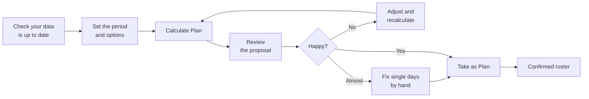

**Planner → Schedule Optimizer.**

**A calculated plan is only a proposal.** It sits to one side, harming nothing,
until you press **Take as Plan**. Calculate as many as you like and compare them.

# Step 1 — Check your data first

Two minutes here saves an hour later. Are this period's holidays and sickness
entered? Have new colleagues got their qualifications ticked? Are the workstations
you want staffed marked *Available*? The planner can only work with what it has
been told.

# Step 2 — Set the period and options

| Control | What it does |
|---|---|
| **Workstations / Employees** | Switches the *display*. No effect on the calculation |
| **Weeks / Date range** | *Weeks* plans forward from now; *Date range* takes exact dates |
| **Plan `4w`** | How many weeks ahead, in *Weeks* mode |
| **Match monthly hours** | Makes the planner work hard at each person's contracted monthly hours. Leave off for a short stretch that isn't a whole month |
| **All Employees** | Restricts the calculation to a subset of staff |

Four weeks is the usual choice. Planning further gives the planner more room to
even out workload, but anything beyond a few weeks tends to be invalidated by real
life.

**Match monthly hours** sets `monthly_hours_target_weight` for that run only, without
changing stored settings.

# Step 3 — Calculate

Press **Calculate Plan**. Work happens in the background — carry on using other
pages. Typical wards take seconds to a couple of minutes; the budget is
`solver_time_limit_seconds` in Planner Settings, default 120.

**Jobs** shows the queue of runs, their status and any error message.

## The result line

> **Period:** Jul 25, 2026 – Aug 21, 2026 **Score:** −17576600.00 **Status:** feasible

| Status | Meaning |
|---|---|
| **optimal** | No better roster exists under your rules |
| **feasible** | A valid roster obeying every hard rule, but the planner ran out of time before proving it best. In practice perfectly good, and what you will normally see |
| **infeasible** | Your rules contradict each other; nothing was produced. See [Infeasibility playbook](/solver/infeasibility-playbook.md) |

**`feasible` is not a warning.** On a ward of any size the planner almost always
hits its time budget first. **Score** is meaningful only against another run over
the *same* period with the *same* settings; higher (less negative) is better.

# Step 4 — Review the proposal

**By workstation** — for each place and day, which shifts run and how many people
are on them. The view for *"is the emergency room covered on Saturday?"*

**By employee** — one row per person, one column per day. The view for *"is this
fair, and does anyone have a horrible week?"*

What to look for:

* **Thin days** — a workstation with fewer people than expected is the planner
  reporting it could not do better. Cross-check against who was away.
* **Unlucky individuals** — scan for an unreasonable run of nights or weekends.
* **Empty rows** — a person with nothing usually means their qualifications or
  available shifts match nothing you asked for.

# Step 5 — Fix individual days by hand

Switch to the **Employees** view — hand editing only works there — and
**right-click a day, or an employee's name**.

| Status | Effect |
|---|---|
| **Assigned** | The person works. Choose shift and workstation |
| **Free (day off)** | Explicitly off that day |
| **Unassigned (no entry)** | Removes the entry altogether |

Right-clicking a *name* edits that person across the plan; a single square edits
just that day. Edits apply to the proposal, so you can tidy it before confirming.

# Step 6 — Confirm it

Press **Take as Plan**.

**This overwrites the confirmed roster for the whole period covered** — including
hand edits someone made directly in the Schedule calendar for those days. If you
have been patching this month's roster by hand, check the
[Schedule view](/guide/reading-calendars.md) before confirming a plan that overlaps
it.

## Confirming only some people

In the **Employees** view each row has a tickbox. Tick a few and a bar appears:

| Button | Effect |
|---|---|
| **Take as Plan** | Confirms **for the ticked people only**, leaving everyone else's roster untouched |
| **Clear Assignments** | Removes the ticked people's assignments from the proposal |
| **Clear Selection** | Unticks everyone |

This is how you adopt a recalculated roster for the two departments that changed
without disturbing the rest of the ward.

# Common variations

**Replanning mid-month after several people go off sick.** Use *Date range*, today
to month end. Review carefully — the first days may shuffle people who already
know their shift. Fix those by hand before confirming.

**Planning one team separately.** Use the **All Employees** dropdown. The planner
then only sees those people and will report shortfalls at every workstation the
others normally cover.

**Comparing two options.** Calculate, look, change one setting, calculate again.
Both runs are kept under **Jobs**; neither affects the confirmed roster until you
press *Take as Plan*.

# Related

* Why it decided that: [Objective terms](/solver/objective-terms.md)
* What happens underneath: [Planning pipeline](/architecture/planning-pipeline.md)
* Something looks wrong: [User troubleshooting](/guide/troubleshooting-playbook.md)
