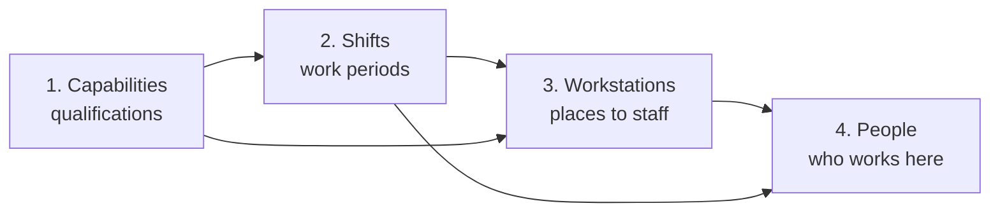

Teaching the software what your ward looks like. It takes an afternoon. After
that you touch these screens only when something real changes. Everything is under
**Configuration**.

# Do it in this order

Each step needs the one before it.

People are covered separately in [Staff management](/guide/staff-management.md).

# 1. Capabilities

A qualification, skill or licence: *Intensive care*, *Emergency room*,
*Anaesthesia*, *Wound care*. It is the link between what a place needs and what a
person can do. Press **Add Capability** and give it a name — that is all most
wards ever need.

**Skill group and level (optional).** Two fields that mark qualifications as
*ranked versions of the same thing* — junior, senior, lead.

* **Skill group** — a short label shared by the ranked tiers, e.g. `nursing`.
  Blank if the qualification has no tiers.
* **Skill level** — a number; higher is more senior. Default `1`.

Fill both in and the planner may cover a junior post with a senior person when it
has to, but avoids doing so, so senior staff are not quietly used up on work
anyone could have done. Leave them blank and nothing changes.

**Keep the list short.** Only create a capability if it genuinely decides *who may
work where*. Each one narrows the eligible pool and makes the roster harder to
fill. See [Capability](/concepts/capability.md).

# 2. Shifts

A named work period — *Early*, *Late*, *Night*, *On call*.

| Field | What to put in it |
|---|---|
| **Shift name** | The full name, as staff know it |
| **Short name** | One or two letters, max 10 characters — this appears in calendar squares |
| **Colour** | Used everywhere. Pick clearly distinct colours; you will read these at a glance |
| **Display order** | Lower numbers first. Number them in the order of the working day |

**Weekday times** — one row per weekday. **Untick a weekday and the shift does not
run that day.** That is how you model a service that does not operate at weekends.

| Column | Meaning |
|---|---|
| **Start / End** | When the shift runs *on that weekday*. End earlier than start means it crosses midnight — a night shift 22:00 to 06:00 is entered exactly like that |
| **Min** | How many people you *want*. A target the planner works towards |
| **Max** | The ceiling. Never exceeded |
| **Free days after** | Compulsory days off after working this shift. Set `2` on nights for the usual recovery rule |

**Why Min is a target but Max is absolute.** If a minimum were absolute, a week
when three people call in sick would produce nothing at all — just the word
"impossible", which helps nobody. Instead you get the best roster achievable with
the gap visible. A maximum is usually a real limit (space, equipment, budget), so
it is enforced strictly. See
[Soft minimum, hard maximum](/architecture/soft-minimum-hard-maximum.md).

A reduced weekend service is the same shift with lower Min and Max on Saturday and
Sunday.

# 3. Workstations

A place that has to be staffed: a ward, a theatre, a unit, a desk.

| Field | What to put in it |
|---|---|
| **Name** | What people on the ward call it |
| **Available** | Untick to take it out of planning without deleting it and losing its history |
| **Priority** | `High`, `Medium`, `Low`. When people run short, high-priority posts are staffed first |
| **Staffing per shift — Min / Max** | Headcount here in one shift. Blank Max means no limit |
| **Active shifts** | Which shifts operate here. A day clinic has nights unticked |
| **Required capabilities** | What someone must hold to work here — **all** of them, not any |
| **Unavailability periods** | Date ranges when the place is closed |

**Required capabilities are the most common cause of trouble.** Ticking four means
only staff holding all four may ever be assigned — often nobody. If a workstation
stubbornly comes back understaffed, look here first.

**Getting priority right.** Priority decides who loses out when the ward is short:

* **High** — must be staffed. Emergency, intensive care, theatres in use.
* **Medium** — normal wards.
* **Low** — desirable but postponable. Outpatient desks, day clinics.

If everything is `High`, priority tells the planner nothing and it spreads the
shortage evenly instead of protecting your critical posts.

# Loading data from Excel

Capabilities, shifts, workstations and staff can all be loaded in bulk. On each
page:

1. **Download Template** — an `.xlsx` with the right columns already in place.
2. Fill it in, one row per item.
3. **Import** and choose your file.

Use the downloaded template rather than building your own spreadsheet; the column
names must match exactly. If your staff list is already in a spreadsheet, this is
far quicker and less error-prone than typing forty people into forms. See
[XLSX import and export](/interfaces/xlsx-import-export.md).

# Next

[Staff management](/guide/staff-management.md).
