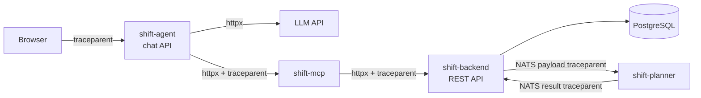

# Observability

All four services — the Rust backend, the Python planner, the chat agent and
the MCP server — export **OpenTelemetry traces and metrics over OTLP**. Nothing
is exported until an endpoint is configured: with `OTEL_EXPORTER_OTLP_ENDPOINT`
unset, the providers are never installed and the instrumentation is inert.

## Turning it on

One variable enables the whole stack:

```bash
export OTEL_EXPORTER_OTLP_ENDPOINT=https://2215171.otel.gitlab-o11y.com:14318
export OTEL_EXPORTER_OTLP_PROTOCOL=http/protobuf       # or grpc, on port 14317
export OTEL_EXPORTER_OTLP_HEADERS='PRIVATE-TOKEN=<token>'   # if the collector wants one
```

For the compose stack, put those in `deploy/.env` (see `deploy/.env.example`);
`docker-compose.yml` passes them to every service and pins each one's
`OTEL_SERVICE_NAME`.

| Variable | Default | Meaning |
|---|---|---|
| `OTEL_EXPORTER_OTLP_ENDPOINT` | *(unset)* | Collector base URL. Empty = telemetry off |
| `OTEL_EXPORTER_OTLP_PROTOCOL` | `grpc` | `grpc` or `http/protobuf` |
| `OTEL_EXPORTER_OTLP_HEADERS` | *(unset)* | `key=value,key2=value2` — where the collector's auth token goes |
| `OTEL_SERVICE_NAME` | per service | `shift-backend`, `shift-planner`, `shift-agent`, `shift-mcp` |

!!! note "gRPC and HTTP take different ports"
    GitLab's endpoints are `:14317` for gRPC and `:14318` for HTTP. The port and
    the protocol have to agree — a gRPC exporter pointed at `:14318` fails to
    export, silently apart from a log line. For OTLP/HTTP the services append
    `/v1/traces` and `/v1/metrics` themselves.

!!! warning "GitLab's gRPC endpoint is currently not serving"
    `https://2215171.otel.gitlab-o11y.com:14317` answers **HTTP 464** (and
    `502` on a plain request) from the `awselb/2.0` load balancer in front of
    it — its gRPC backend is unhealthy, for any client, `curl` included. The
    exporter surfaces this as `gRPC code: Unknown — grpc-status header
    missing, mapped from HTTP status code 464`. Nothing to fix on this side:
    use `http/protobuf` against `:14318`, which is verified working, and
    revisit gRPC once GitLab's listener is healthy.

### Resource attributes

Filled from GitLab's CI/CD variables when present, so telemetry links back to
the project and the exact deployed commit:

| Attribute | Source variable | Purpose |
|---|---|---|
| `gitlab.project.id` | `CI_PROJECT_ID` | Links telemetry to the project — required for GitLab Duo |
| `gitlab.project.name` | `CI_PROJECT_NAME` | Display name in dashboards |
| `service.version` | `CI_COMMIT_SHA` | Correlates traces and errors with the deployed revision |
| `deployment.environment.name` | `CI_ENVIRONMENT_NAME` | `production`, `staging`, … |

A pipeline that deploys with these variables in scope needs no further
configuration. For a manual deployment, set them in `deploy/.env`.

### Backend: config file and CLI flags

The Rust backend also takes the settings through its normal configuration
layers, which win over the environment:

```yaml
otel:
  endpoint: ""            # empty = disabled, falls back to OTEL_EXPORTER_OTLP_ENDPOINT
  protocol: "grpc"        # grpc | http
  headers: ""             # "key=value,key2=value2"
  service_name: "shift-backend"
  service_version: ""     # CI_COMMIT_SHA
  environment: ""         # CI_ENVIRONMENT_NAME
  gitlab_project_id: ""   # CI_PROJECT_ID
  gitlab_project_name: "" # CI_PROJECT_NAME
  sample_ratio: 1.0       # head sampling for traces this service starts
```

| Flag | Overrides |
|---|---|
| `--otel-endpoint` | `otel.endpoint` |
| `--otel-protocol` | `otel.protocol` |
| `--otel-service-name` | `otel.service_name` |

`sample_ratio` applies only to traces the backend starts: a request that
arrives with a sampled `traceparent` is always recorded, so a sampled trace
stays complete across services.

## What is traced



Context travels as a W3C `traceparent`: an HTTP header between the HTTP hops,
and a field inside the JSON payload across NATS, which carries no headers of
its own. So one chat message that ends up changing planner settings, or one
plan request that runs a solve, is a single trace end to end.

| Service | Spans |
|---|---|
| `shift-backend` | One server span per request, named after the **matched route** (`GET /api/v1/employees/:employee_id`) so paths don't explode by id; one client span per **SQL statement**, named `SELECT employees`-style; producer/consumer spans for the NATS scheduling round trip |
| `shift-planner` | Server spans for the REST API; a consumer span per NATS job continuing the backend's trace; a `planner.solve` span carrying employee/workstation/shift counts, status and objective value |
| `shift-agent` | A server span per `POST /api/v1/chat`, an `agent.chat` span over the whole turn, a client span per MCP tool call, and httpx spans for the LLM calls |
| `shift-mcp` | A server span per MCP HTTP request, an `mcp.tool <name>` span per tool call, and an httpx span for the backend call it makes |

Database spans record `db.query.text` with **bind parameters stripped** —
Diesel's debug output includes the bound values, which are real employee data —
and are capped at 1 KiB.

## Metrics

| Metric | Service | Unit | Attributes |
|---|---|---|---|
| `http.server.request.duration` | backend | s | `http.request.method`, `http.route`, `http.response.status_code` |
| `db.client.operation.duration` | backend | s | `db.operation.name`, `error` |
| `messaging.client.published.messages` | backend | count | `messaging.destination.name` |
| `messaging.client.consumed.messages` | backend | count | `messaging.destination.name` |
| `planner.solve.duration` | planner | s | `planner.status` |
| `planner.solve.total` | planner | count | `planner.status` |
| `agent.chat.duration` / `agent.chat.total` | agent | s / count | `agent.outcome` |
| `agent.tool.duration` / `agent.tool.total` | agent | s / count | `mcp.tool.name`, `agent.outcome` |

The planner and agent also get the standard HTTP server metrics from their
Flask instrumentation. Metrics are exported every 30 s.

## Logs

The backend logs through `tracing`, so `RUST_LOG` controls verbosity
(`RUST_LOG=debug`, `RUST_LOG=shift=debug,hyper=info`); without it, `--verbose`
selects `debug` and the default is `info`. Log records are not exported over
OTLP — only traces and metrics are.

## Checking it works

Each service prints its telemetry status at startup:

```
Telemetry: https://2215171.otel.gitlab-o11y.com:14317 (grpc)
```

or `disabled (no OTLP endpoint configured)`. A bad endpoint does not stop a
service from starting: export failures are logged and the service keeps
serving.

Export failures are logged at `ERROR` with a one-line summary; the underlying
cause is a `DEBUG` record from the exporter, so raise the level to see it:

```bash
RUST_LOG=info,opentelemetry=debug   # backend — HttpClient.NetworkError et al.
```

To try it without a collector, run one locally and point the stack at it:

```bash
docker run --rm -p 4317:4317 -p 4318:4318 \
  otel/opentelemetry-collector-contrib:latest
export OTEL_EXPORTER_OTLP_ENDPOINT=http://localhost:4317
```

## Adding instrumentation

- **Backend** — HTTP and SQL are covered automatically. For anything else, add
  `#[tracing::instrument]` to the function, or open a span with
  `tracing::info_span!`; both land in the trace with no further wiring.
  Repository methods must run their queries through `telemetry::db_blocking`
  rather than `tokio::task::spawn_blocking`, or their SQL spans lose the
  request they belong to (span context does not cross the blocking-thread hop).
- **Planner / agent** — use the `telemetry.span()` context manager. It yields
  `None` when telemetry is off, and `telemetry.set_attributes()` tolerates
  that, so instrumented code needs no `if enabled` branches.
